# DriveBook — Instructor Journey

**Version:** 1.0
**Status:** Active
**Last updated:** June 2026

> This document is the complete user-flow map of the DriveBook instructor mobile app.
> It is the source of truth for what an instructor sees, does, and experiences from
> first download through every possible interaction with the platform.
>
> Mermaid diagrams below can be imported into FigJam via the Mermaid Chart plugin
> or rendered at https://mermaid.live and dragged in as images.
>
> Read alongside `PRD.md`, `DriveBook_Cancellation_and_Confirmation_Policy.md`,
> and `DriveBook_Student_Journey.md`.

---

## 1. Overview

The instructor app is the supply-side surface of DriveBook. It is a React Native + Expo mobile application available on iOS and Android. Instructors use it to register, get verified, publish their availability for the next 7 days, accept or decline bookings, conduct lessons, and get paid.

Every flow in this document follows the locked Phase 1 model:

- Instructor receives $45 per completed lesson
- Manual confirmation by default with 1-hour SLA
- Auto-Confirm is opt-in with consent modal
- Instant Booking is opt-in with consent modal
- 3-strike accountability system
- Per `DriveBook_Cancellation_and_Confirmation_Policy.md`

---

## 2. Instructor Personas

The flows in this document are tested against three instructor personas:

| Persona | Snapshot | Primary need |
|---|---|---|
| **Michael** | 41, North York, 8 years experience, MTO-certified, English + Cantonese | Reliable bookings, fewer no-shows, online profile |
| **Sandeep** | 35, Brampton, 5 years experience, Punjabi + Hindi + English | Steady student pipeline, simple scheduling |
| **Reza** | 52, Scarborough, 15 years experience, Farsi + English | Premium reputation, full calendar, low admin |

---

## 3. Screen Inventory

Every distinct screen the instructor can land on, numbered for reference.

| # | Screen | Purpose |
|---|---|---|
| I01 | Splash | App launch animation |
| I02 | Welcome carousel | 3 slides explaining DriveBook for instructors |
| I03 | Sign Up / Log In | Auth entry |
| I04 | Signup form | Email, password, name, phone, role = instructor |
| I05 | Email verification pending | "Check your email" |
| I06 | Login form | Email + password |
| I07 | Forgot password | Reset request |
| I08 | Onboarding intro | "Let's get you set up — takes about 15 minutes" |
| I09 | Profile basics | Bio, years experience, hourly rate (locked to $60), languages |
| I10 | Vehicle details | Make, model, year, insurance reference |
| I11 | Service area picker | Postal code prefixes + map polygon |
| I12 | Document upload - MTO cert | Upload MTO instructor certificate |
| I13 | Document upload - Government ID | Driver's licence or passport |
| I14 | Document upload - Insurance | Commercial insurance proof |
| I15 | Onboarding review | Summary before submission |
| I16 | Submission confirmation | "Your application is under review" |
| I17 | Pending approval | Holding screen — checked daily |
| I18 | Approval notification | "You're approved — let's set availability" |
| I19 | Rejection notification | "We couldn't approve — here's why + resubmit" |
| I20 | Home dashboard | Earnings, pending bookings, upcoming lessons, strike count |
| I21 | Availability calendar | 7-day rolling view with publish controls |
| I22 | Add availability slot | Date, start, end, recurrence |
| I23 | Edit/delete slot | Modify or remove a published slot |
| I24 | Auto-Confirm toggle | Settings screen with consent modal |
| I25 | Auto-Confirm consent modal | "Agree to auto-accept all bookings" |
| I26 | Instant Booking toggle | Settings screen with consent modal |
| I27 | Instant Booking consent modal | "Agree to strict Instant policy" |
| I28 | New booking request | Manual mode: 1-hour SLA prompt |
| I29 | Booking accepted | "You confirmed the booking" |
| I30 | Booking declined | "You declined the booking" |
| I31 | Bookings inbox | All pending, confirmed, completed bookings |
| I32 | Booking detail | Full view of one booking |
| I33 | Auto-confirmed notification | "A booking was auto-accepted" |
| I34 | 2-hour check-in prompt | "Your lesson with [Student] is in 2 hours — on your way?" |
| I35 | Check-in confirmed | "We've told the student you're on the way" |
| I36 | At-risk warning | "You missed the check-in — booking flagged" |
| I37 | Pre-lesson screen | Navigation + student details + pickup pin |
| I38 | Lesson in progress | Static timer + end lesson button |
| I39 | Mark student no-show | "Confirm student didn't arrive after 15 min" |
| I40 | Lesson completed | "Lesson complete — payout pending" |
| I41 | Cancel booking | Cancellation form with penalty preview |
| I42 | Cancellation confirmed | "Cancellation processed" |
| I43 | Earnings dashboard | Total, pending, paid-out by week |
| I44 | Payout schedule | When next payout is, Stripe Connect status |
| I45 | Stripe Connect onboarding | External Stripe flow for payout account |
| I46 | Strike notification | "You received a strike — here's why" |
| I47 | Strike history | All strikes, dates, reasons |
| I48 | Account flagged | 2-strike warning screen |
| I49 | Account suspended | 3-strike pause + appeal contact |
| I50 | Dispute received | A student submitted a dispute |
| I51 | Dispute response form | Instructor's side of the story |
| I52 | Dispute resolved | "Admin resolved the dispute" |
| I53 | Account settings | Profile, vehicle, service area, payment, notifications |
| I54 | Edit profile | Bio, languages, photo |
| I55 | Notification preferences | Toggle push, email, SMS |
| I56 | Help / Support | FAQ + contact form |
| I57 | Error - network | "No connection" |
| I58 | Error - document upload | File too big, wrong format |

---

## 4. Notification Inventory

| # | Event | Trigger | Channel |
|---|---|---|---|
| IN01 | Welcome | Account created | Email |
| IN02 | Email verification | Signup | Email |
| IN03 | Password reset | Forgot password | Email |
| IN04 | Application submitted | Onboarding complete | Email |
| IN05 | Application approved | Admin approves | Push + Email |
| IN06 | Application rejected | Admin rejects | Push + Email |
| IN07 | New booking request | Student books, manual mode | Push (urgent) |
| IN08 | 30-min SLA warning | 30 min into 1-hr SLA | Push |
| IN09 | 10-min SLA final warning | 50 min into 1-hr SLA | Push |
| IN10 | Booking auto-confirmed | Auto-Confirm accepted a booking | Push + Email |
| IN11 | Instant Booking received | Student booked instant slot | Push (urgent) |
| IN12 | 2-hour check-in | 2 hours before any lesson | Push |
| IN13 | Check-in follow-up | 30 min later if no response | Push |
| IN14 | Check-in escalation | 60 min later if no response | Push + SMS |
| IN15 | Student cancelled | Student cancelled booking | Push + Email |
| IN16 | Student no-show recorded | Instructor marked no-show | Push |
| IN17 | Lesson completed | Auto-completion ran | Push |
| IN18 | Strike issued | Any strike trigger fired | Push + Email |
| IN19 | 2-strike warning | Hit 2 strikes | Push + Email |
| IN20 | Account suspended | Hit 3 strikes | Push + Email + SMS |
| IN21 | Payout sent | Stripe payout to bank | Push + Email |
| IN22 | Dispute received | Student submitted dispute | Push + Email |
| IN23 | Dispute resolved | Admin closed dispute | Push + Email |
| IN24 | App-close reminder | Instructor closes app with Auto-Confirm ON | Push (in-app) |
| IN25 | Slot fully booked | Student booked your slot | Push |
| IN26 | Availability ending | Last day of 7-day calendar approaching | Push |

---

## 5. Flow Diagrams by Feature Area

### 5.1 First-Time Open + Signup

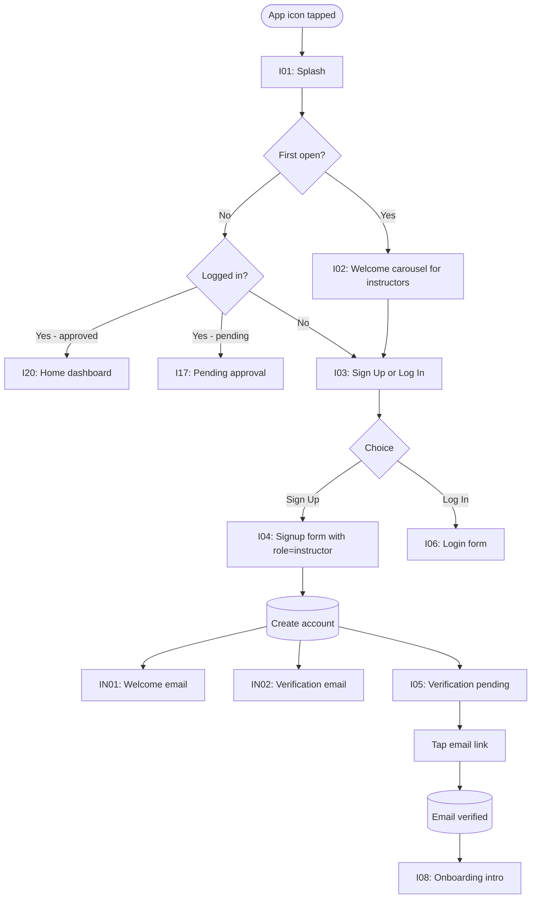
```mermaid
flowchart TD
  Start([App icon tapped]) --> I01[I01: Splash]
  I01 --> FirstTime{First open?}
  FirstTime -->|Yes| I02[I02: Welcome carousel for instructors]
  FirstTime -->|No| LoggedIn{Logged in?}
  LoggedIn -->|Yes - approved| I20[I20: Home dashboard]
  LoggedIn -->|Yes - pending| I17[I17: Pending approval]
  LoggedIn -->|No| I03[I03: Sign Up or Log In]
  I02 --> I03
  I03 --> Choice{Choice}
  Choice -->|Sign Up| I04[I04: Signup form with role=instructor]
  Choice -->|Log In| I06[I06: Login form]
  I04 --> Submit[(Create account)]
  Submit --> IN01[IN01: Welcome email]
  Submit --> IN02[IN02: Verification email]
  Submit --> I05[I05: Verification pending]
  I05 --> Tap[Tap email link]
  Tap --> Verified[(Email verified)]
  Verified --> I08[I08: Onboarding intro]
```

---

### 5.2 Onboarding Flow

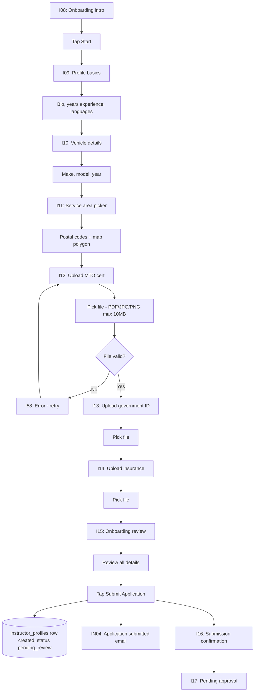
```mermaid
flowchart TD
  I08[I08: Onboarding intro] --> Start[Tap Start]
  Start --> I09[I09: Profile basics]
  I09 --> Profile[Bio, years experience, languages]
  Profile --> I10[I10: Vehicle details]
  I10 --> Vehicle[Make, model, year]
  Vehicle --> I11[I11: Service area picker]
  I11 --> Areas[Postal codes + map polygon]
  Areas --> I12[I12: Upload MTO cert]
  I12 --> UploadMTO[Pick file - PDF/JPG/PNG max 10MB]
  UploadMTO --> ValidMTO{File valid?}
  ValidMTO -->|No| I58a[I58: Error - retry]
  ValidMTO -->|Yes| I13[I13: Upload government ID]
  I58a --> I12
  I13 --> UploadID[Pick file]
  UploadID --> I14[I14: Upload insurance]
  I14 --> UploadIns[Pick file]
  UploadIns --> I15[I15: Onboarding review]
  I15 --> Review[Review all details]
  Review --> Submit[Tap Submit Application]
  Submit --> Store[(instructor_profiles row created, status pending_review)]
  Submit --> IN04[IN04: Application submitted email]
  Submit --> I16[I16: Submission confirmation]
  I16 --> I17[I17: Pending approval]
```

---

### 5.3 Approval Outcome (Approved or Rejected)

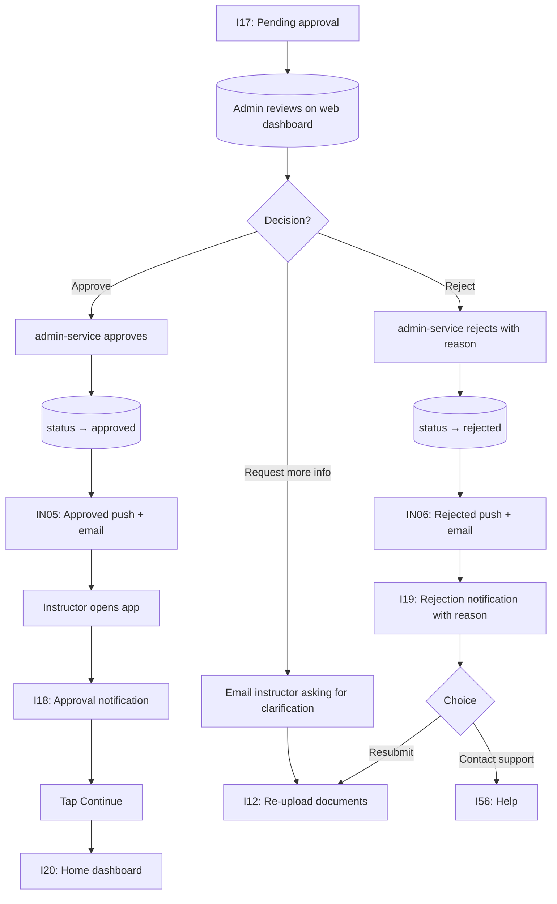
```mermaid
flowchart TD
  I17[I17: Pending approval] --> AdminReview[(Admin reviews on web dashboard)]
  AdminReview --> Decision{Decision?}
  Decision -->|Approve| ApproveFlow[admin-service approves]
  Decision -->|Reject| RejectFlow[admin-service rejects with reason]
  Decision -->|Request more info| MoreInfo[Email instructor asking for clarification]
  ApproveFlow --> StatusApproved[(status → approved)]
  StatusApproved --> IN05[IN05: Approved push + email]
  IN05 --> Open[Instructor opens app]
  Open --> I18[I18: Approval notification]
  I18 --> Continue[Tap Continue]
  Continue --> I20[I20: Home dashboard]
  RejectFlow --> StatusRejected[(status → rejected)]
  StatusRejected --> IN06[IN06: Rejected push + email]
  IN06 --> I19[I19: Rejection notification with reason]
  I19 --> Choice{Choice}
  Choice -->|Resubmit| I12[I12: Re-upload documents]
  Choice -->|Contact support| I56[I56: Help]
  MoreInfo --> I12
```

---

### 5.4 Publishing Availability

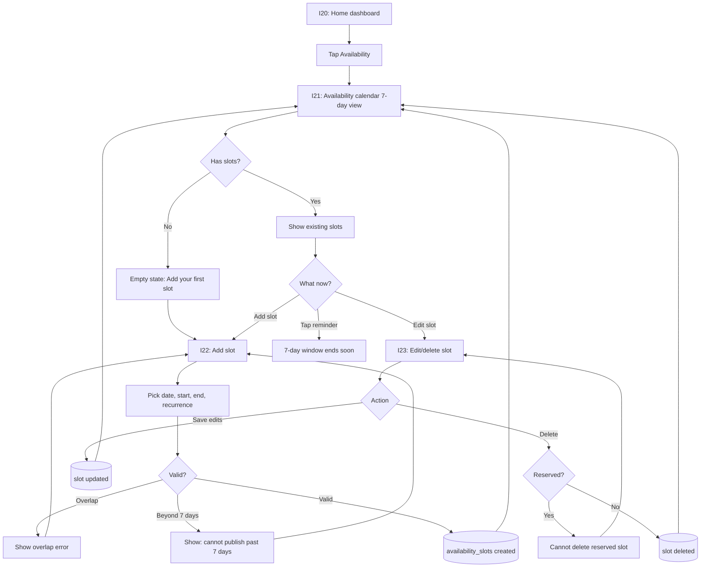
```mermaid
flowchart TD
  I20[I20: Home dashboard] --> TapAvail[Tap Availability]
  TapAvail --> I21[I21: Availability calendar 7-day view]
  I21 --> Empty{Has slots?}
  Empty -->|No| EmptyState[Empty state: Add your first slot]
  Empty -->|Yes| ShowSlots[Show existing slots]
  EmptyState --> I22[I22: Add slot]
  ShowSlots --> Action{What now?}
  Action -->|Add slot| I22
  Action -->|Edit slot| I23[I23: Edit/delete slot]
  Action -->|Tap reminder| Reminder[7-day window ends soon]
  I22 --> Pick[Pick date, start, end, recurrence]
  Pick --> Validate{Valid?}
  Validate -->|Overlap| Error[Show overlap error]
  Validate -->|Beyond 7 days| Error2[Show: cannot publish past 7 days]
  Validate -->|Valid| Save[(availability_slots created)]
  Error --> I22
  Error2 --> I22
  Save --> I21
  I23 --> EditAction{Action}
  EditAction -->|Save edits| SaveEdit[(slot updated)]
  EditAction -->|Delete| CheckReserved{Reserved?}
  CheckReserved -->|Yes| Block[Cannot delete reserved slot]
  CheckReserved -->|No| DeleteSlot[(slot deleted)]
  SaveEdit --> I21
  DeleteSlot --> I21
  Block --> I23
```

---

### 5.5 Auto-Confirm Toggle Flow

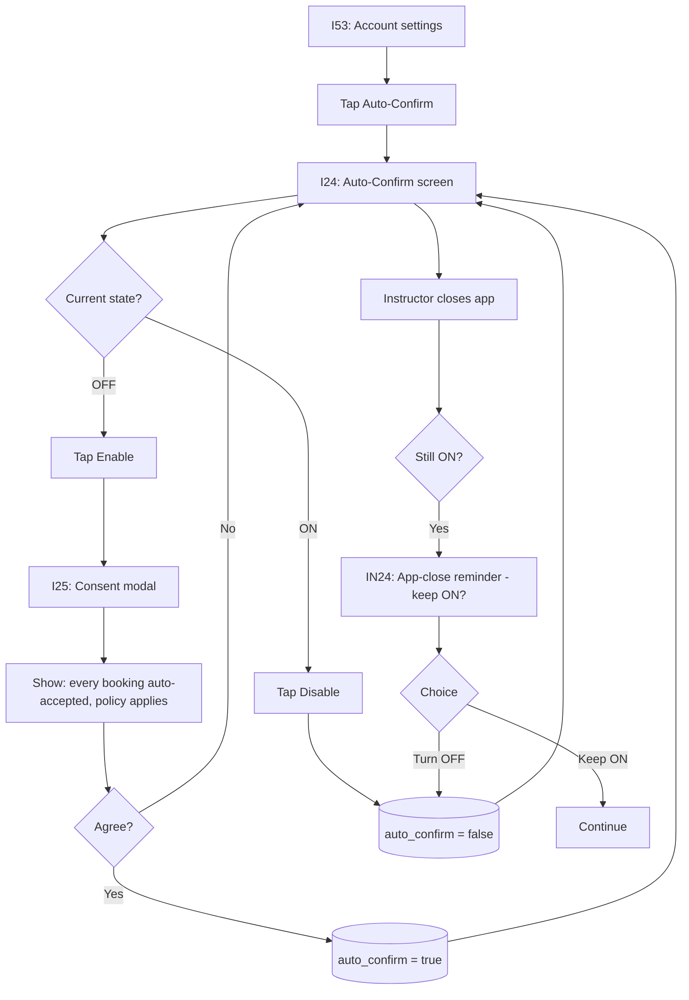
```mermaid
flowchart TD
  I53[I53: Account settings] --> TapAuto[Tap Auto-Confirm]
  TapAuto --> I24[I24: Auto-Confirm screen]
  I24 --> Current{Current state?}
  Current -->|OFF| TurnOn[Tap Enable]
  Current -->|ON| TurnOff[Tap Disable]
  TurnOn --> I25[I25: Consent modal]
  I25 --> Modal[Show: every booking auto-accepted, policy applies]
  Modal --> Agree{Agree?}
  Agree -->|Yes| Enable[(auto_confirm = true)]
  Agree -->|No| I24
  Enable --> I24
  TurnOff --> Disable[(auto_confirm = false)]
  Disable --> I24
  I24 --> Close[Instructor closes app]
  Close --> StillOn{Still ON?}
  StillOn -->|Yes| IN24[IN24: App-close reminder - keep ON?]
  IN24 --> Choice{Choice}
  Choice -->|Keep ON| Done[Continue]
  Choice -->|Turn OFF| Disable
```

---

### 5.6 Instant Booking Toggle Flow

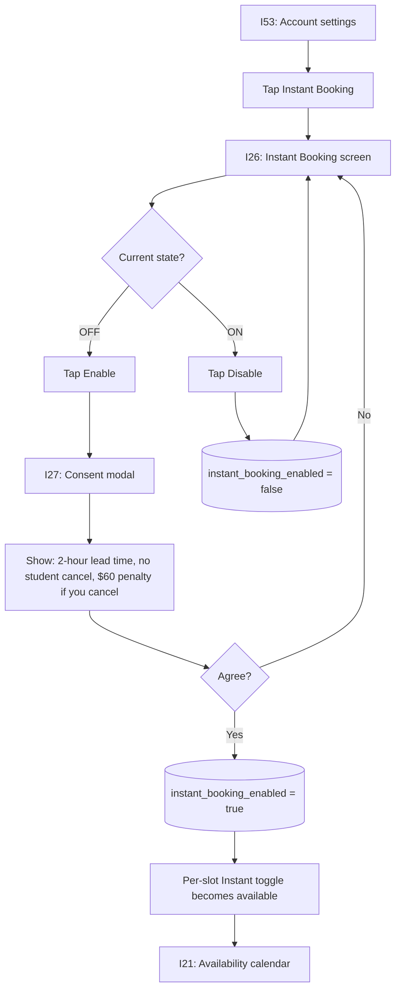
```mermaid
flowchart TD
  I53[I53: Account settings] --> TapInstant[Tap Instant Booking]
  TapInstant --> I26[I26: Instant Booking screen]
  I26 --> Current{Current state?}
  Current -->|OFF| Enable[Tap Enable]
  Current -->|ON| Disable[Tap Disable]
  Enable --> I27[I27: Consent modal]
  I27 --> Show[Show: 2-hour lead time, no student cancel, $60 penalty if you cancel]
  Show --> Agree{Agree?}
  Agree -->|Yes| StoreOn[(instant_booking_enabled = true)]
  Agree -->|No| I26
  StoreOn --> SetSlots[Per-slot Instant toggle becomes available]
  SetSlots --> I21[I21: Availability calendar]
  Disable --> StoreOff[(instant_booking_enabled = false)]
  StoreOff --> I26
```

---

### 5.7 Receiving a Manual Booking Request (1-Hour SLA Race)

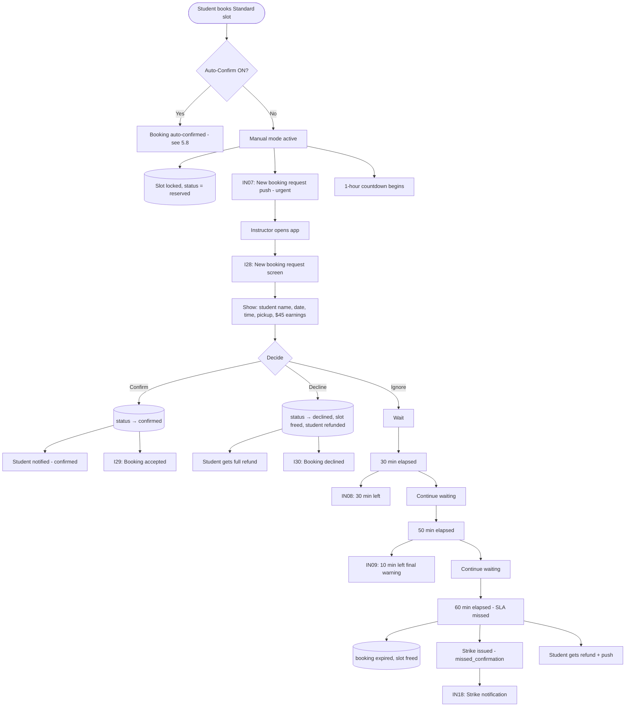
```mermaid
flowchart TD
  Trigger([Student books Standard slot]) --> Mode{Auto-Confirm ON?}
  Mode -->|Yes| AutoAccept[Booking auto-confirmed - see 5.8]
  Mode -->|No| ManualPath[Manual mode active]
  ManualPath --> Lock[(Slot locked, status = reserved)]
  ManualPath --> IN07[IN07: New booking request push - urgent]
  ManualPath --> Timer[1-hour countdown begins]
  IN07 --> Open[Instructor opens app]
  Open --> I28[I28: New booking request screen]
  I28 --> Details[Show: student name, date, time, pickup, $45 earnings]
  Details --> Decision{Decide}
  Decision -->|Confirm| Confirm[(status → confirmed)]
  Decision -->|Decline| Decline[(status → declined, slot freed, student refunded)]
  Decision -->|Ignore| Wait[Wait]
  Confirm --> IN10a[Student notified - confirmed]
  Confirm --> I29[I29: Booking accepted]
  Decline --> StudentRefund[Student gets full refund]
  Decline --> I30[I30: Booking declined]
  Wait --> T30[30 min elapsed]
  T30 --> IN08[IN08: 30 min left]
  T30 --> Wait2[Continue waiting]
  Wait2 --> T50[50 min elapsed]
  T50 --> IN09[IN09: 10 min left final warning]
  T50 --> Wait3[Continue waiting]
  Wait3 --> T60[60 min elapsed - SLA missed]
  T60 --> Expire[(booking expired, slot freed)]
  T60 --> StrikeIssued[Strike issued - missed_confirmation]
  StrikeIssued --> IN18[IN18: Strike notification]
  T60 --> StudentNotified[Student gets refund + push]
```

---

### 5.8 Receiving an Auto-Confirmed Booking

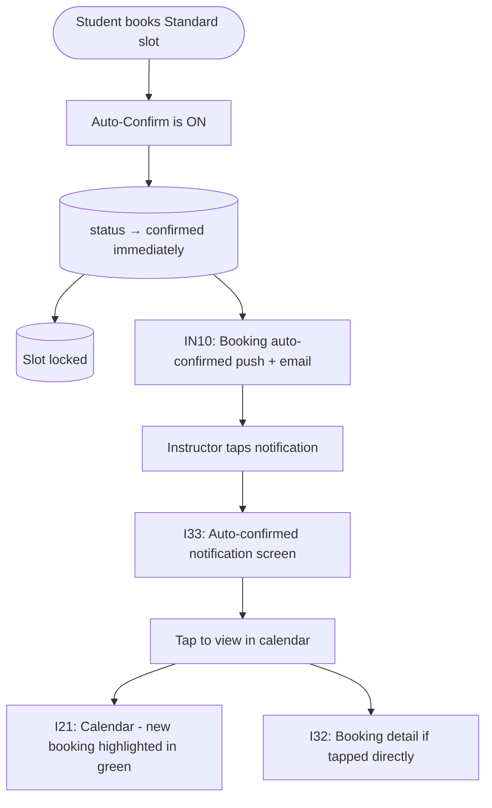
```mermaid
flowchart TD
  Trigger([Student books Standard slot]) --> Check[Auto-Confirm is ON]
  Check --> Confirm[(status → confirmed immediately)]
  Confirm --> Lock[(Slot locked)]
  Confirm --> IN10[IN10: Booking auto-confirmed push + email]
  IN10 --> Open[Instructor taps notification]
  Open --> I33[I33: Auto-confirmed notification screen]
  I33 --> Calendar[Tap to view in calendar]
  Calendar --> I21[I21: Calendar - new booking highlighted in green]
  Calendar --> I32[I32: Booking detail if tapped directly]
```

---

### 5.9 Receiving an Instant Booking

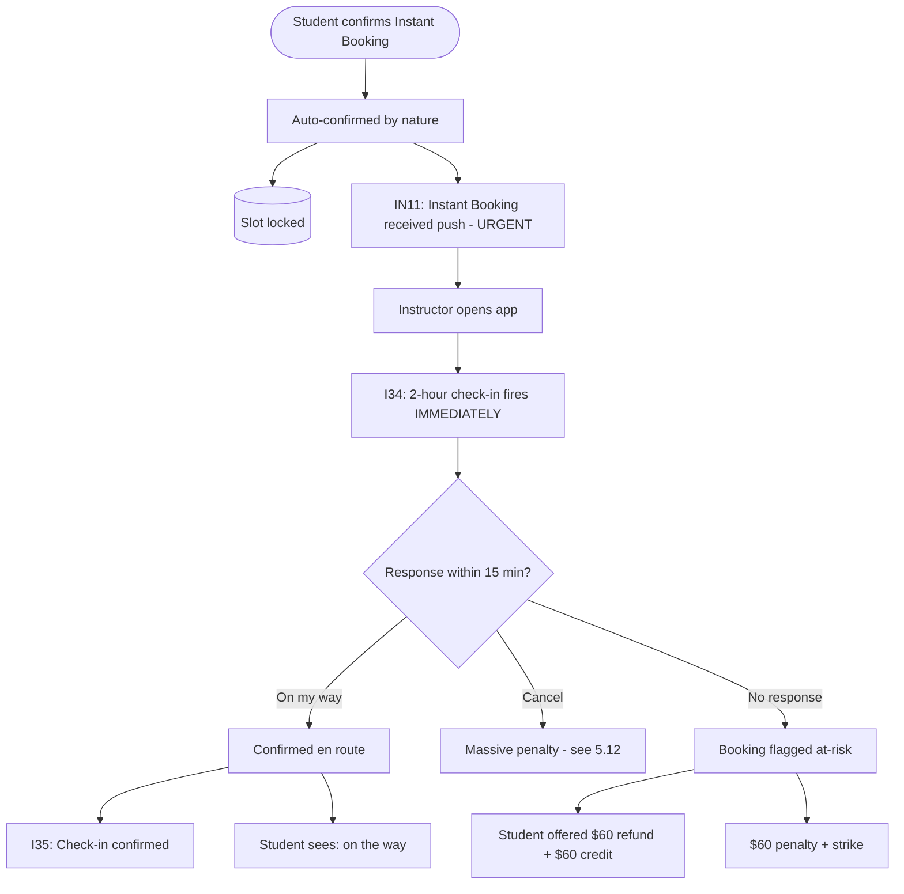
```mermaid
flowchart TD
  Trigger([Student confirms Instant Booking]) --> Auto[Auto-confirmed by nature]
  Auto --> Lock[(Slot locked)]
  Auto --> IN11[IN11: Instant Booking received push - URGENT]
  IN11 --> Open[Instructor opens app]
  Open --> I34a[I34: 2-hour check-in fires IMMEDIATELY]
  I34a --> Decide{Response within 15 min?}
  Decide -->|On my way| Confirm[Confirmed en route]
  Decide -->|Cancel| InstantCancel[Massive penalty - see 5.12]
  Decide -->|No response| Flag[Booking flagged at-risk]
  Confirm --> I35[I35: Check-in confirmed]
  Confirm --> StudentNotified[Student sees: on the way]
  Flag --> StudentOffered[Student offered $60 refund + $60 credit]
  Flag --> InstructorPenalty[$60 penalty + strike]
```

---

### 5.10 2-Hour Pre-Lesson Check-In (All Bookings)

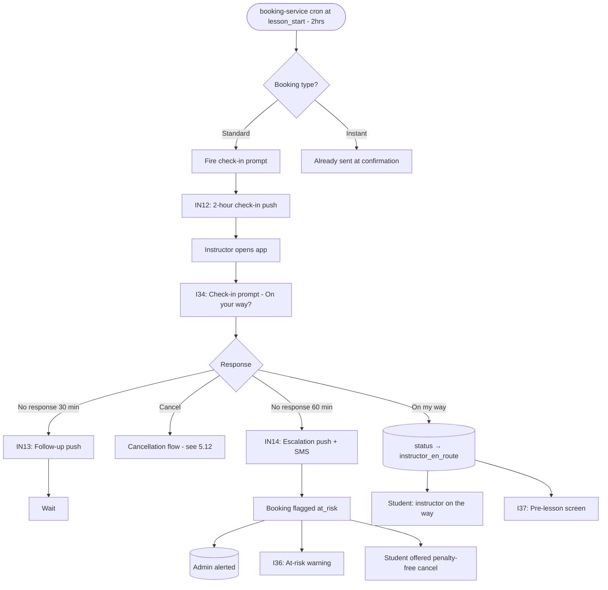
```mermaid
flowchart TD
  Cron([booking-service cron at lesson_start - 2hrs]) --> Type{Booking type?}
  Type -->|Standard| Standard[Fire check-in prompt]
  Type -->|Instant| AlreadySent[Already sent at confirmation]
  Standard --> IN12[IN12: 2-hour check-in push]
  IN12 --> Open[Instructor opens app]
  Open --> I34[I34: Check-in prompt - On your way?]
  I34 --> Response{Response}
  Response -->|On my way| ConfirmEnRoute[(status → instructor_en_route)]
  Response -->|Cancel| CancelFlow[Cancellation flow - see 5.12]
  Response -->|No response 30 min| IN13[IN13: Follow-up push]
  Response -->|No response 60 min| IN14[IN14: Escalation push + SMS]
  IN13 --> Wait[Wait]
  IN14 --> AtRisk[Booking flagged at_risk]
  AtRisk --> AdminAlert[(Admin alerted)]
  AtRisk --> I36[I36: At-risk warning]
  AtRisk --> StudentOffer[Student offered penalty-free cancel]
  ConfirmEnRoute --> StudentPush[Student: instructor on the way]
  ConfirmEnRoute --> I37[I37: Pre-lesson screen]
```

---

### 5.11 Conducting the Lesson

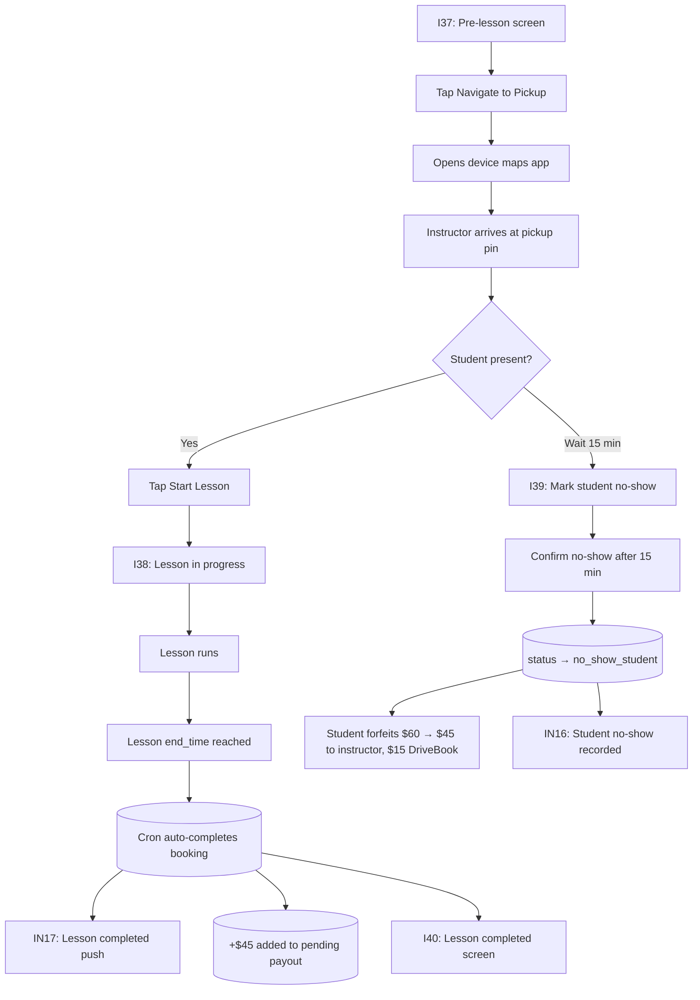
```mermaid
flowchart TD
  I37[I37: Pre-lesson screen] --> Navigate[Tap Navigate to Pickup]
  Navigate --> Maps[Opens device maps app]
  Maps --> Arrive[Instructor arrives at pickup pin]
  Arrive --> StudentThere{Student present?}
  StudentThere -->|Yes| Start[Tap Start Lesson]
  StudentThere -->|Wait 15 min| I39[I39: Mark student no-show]
  Start --> I38[I38: Lesson in progress]
  I38 --> Time[Lesson runs]
  Time --> EndTime[Lesson end_time reached]
  EndTime --> AutoComplete[(Cron auto-completes booking)]
  AutoComplete --> IN17[IN17: Lesson completed push]
  AutoComplete --> Earnings[(+$45 added to pending payout)]
  AutoComplete --> I40[I40: Lesson completed screen]
  I39 --> Confirm[Confirm no-show after 15 min]
  Confirm --> NoShowSubmit[(status → no_show_student)]
  NoShowSubmit --> Forfeit[Student forfeits $60 → $45 to instructor, $15 DriveBook]
  NoShowSubmit --> IN16[IN16: Student no-show recorded]
```

---

### 5.12 Cancelling a Booking (Both Booking Types)

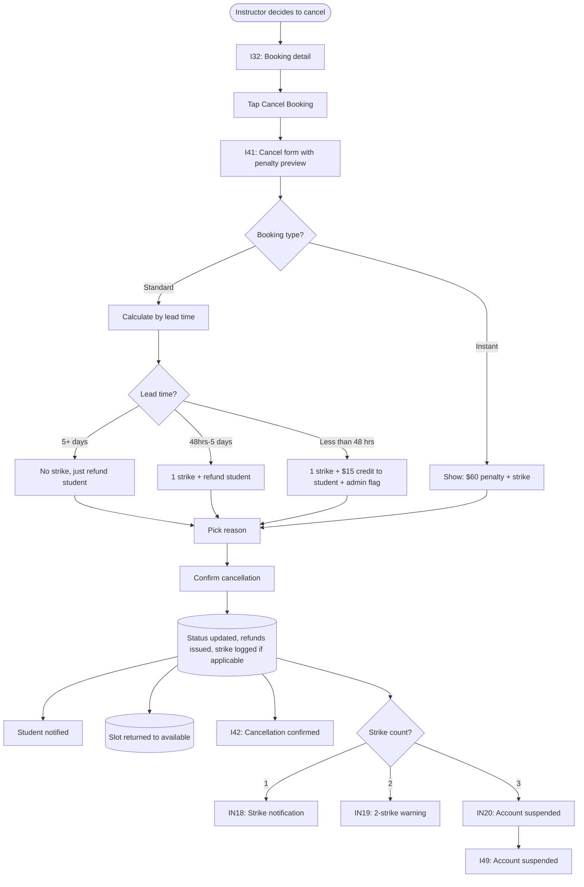
```mermaid
flowchart TD
  Trigger([Instructor decides to cancel]) --> I32[I32: Booking detail]
  I32 --> Tap[Tap Cancel Booking]
  Tap --> I41[I41: Cancel form with penalty preview]
  I41 --> Type{Booking type?}
  Type -->|Standard| StandardCheck[Calculate by lead time]
  Type -->|Instant| InstantHard[Show: $60 penalty + strike]
  StandardCheck --> LeadTime{Lead time?}
  LeadTime -->|5+ days| NoPenalty[No strike, just refund student]
  LeadTime -->|48hrs-5 days| OneStrike[1 strike + refund student]
  LeadTime -->|Less than 48 hrs| HardStrike[1 strike + $15 credit to student + admin flag]
  NoPenalty --> Reason[Pick reason]
  OneStrike --> Reason
  HardStrike --> Reason
  InstantHard --> Reason
  Reason --> Confirm[Confirm cancellation]
  Confirm --> Process[(Status updated, refunds issued, strike logged if applicable)]
  Process --> StudentNotified[Student notified]
  Process --> SlotFreed[(Slot returned to available)]
  Process --> I42[I42: Cancellation confirmed]
  Process --> CheckStrikes{Strike count?}
  CheckStrikes -->|1| IN18[IN18: Strike notification]
  CheckStrikes -->|2| IN19[IN19: 2-strike warning]
  CheckStrikes -->|3| IN20[IN20: Account suspended]
  IN20 --> I49[I49: Account suspended]
```

---

### 5.13 Strike System Progression

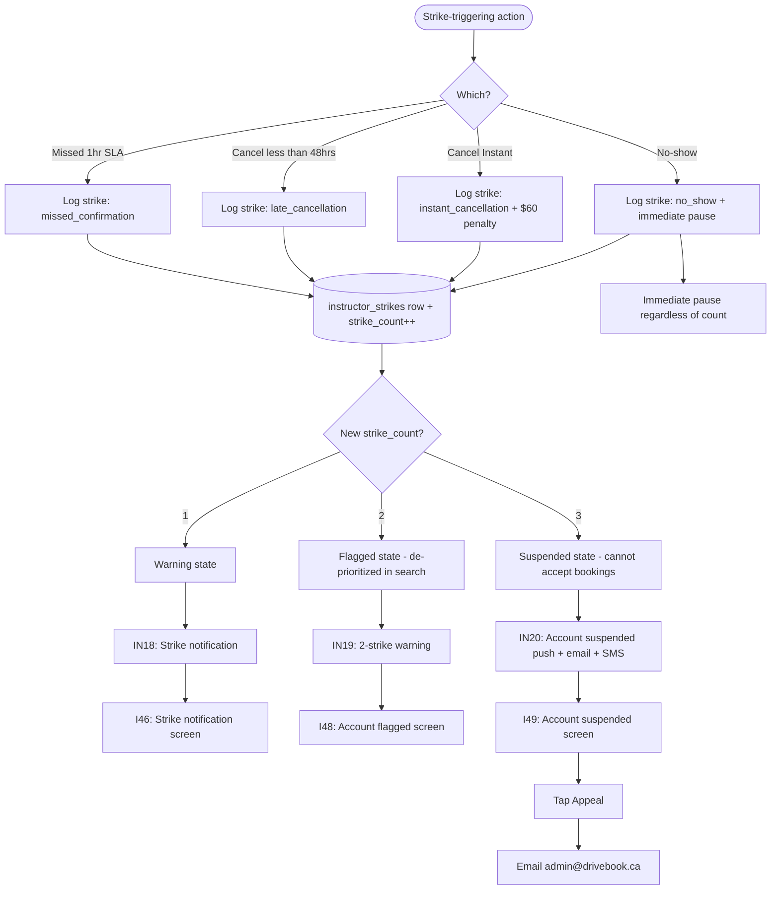
```mermaid
flowchart TD
  Action([Strike-triggering action]) --> Reasons{Which?}
  Reasons -->|Missed 1hr SLA| Strike1[Log strike: missed_confirmation]
  Reasons -->|Cancel less than 48hrs| Strike2[Log strike: late_cancellation]
  Reasons -->|Cancel Instant| Strike3[Log strike: instant_cancellation + $60 penalty]
  Reasons -->|No-show| Strike4[Log strike: no_show + immediate pause]
  Strike1 --> Update[(instructor_strikes row + strike_count++)]
  Strike2 --> Update
  Strike3 --> Update
  Strike4 --> Update
  Update --> Count{New strike_count?}
  Count -->|1| Warn[Warning state]
  Count -->|2| Flag[Flagged state - de-prioritized in search]
  Count -->|3| Suspend[Suspended state - cannot accept bookings]
  Warn --> IN18[IN18: Strike notification]
  Flag --> IN19[IN19: 2-strike warning]
  Suspend --> IN20[IN20: Account suspended push + email + SMS]
  IN18 --> I46[I46: Strike notification screen]
  IN19 --> I48[I48: Account flagged screen]
  IN20 --> I49[I49: Account suspended screen]
  I49 --> Appeal[Tap Appeal]
  Appeal --> ContactAdmin[Email admin@drivebook.ca]
  Strike4 --> ImmediatePause[Immediate pause regardless of count]
```

---

### 5.14 Earnings + Payout Flow

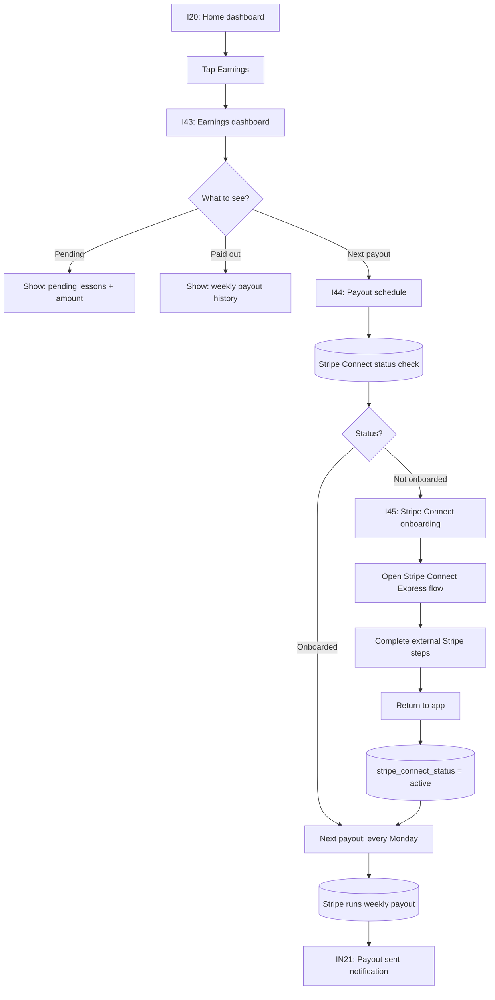
```mermaid
flowchart TD
  I20[I20: Home dashboard] --> Earnings[Tap Earnings]
  Earnings --> I43[I43: Earnings dashboard]
  I43 --> View{What to see?}
  View -->|Pending| Pending[Show: pending lessons + amount]
  View -->|Paid out| PaidOut[Show: weekly payout history]
  View -->|Next payout| I44[I44: Payout schedule]
  I44 --> Stripe[(Stripe Connect status check)]
  Stripe --> Status{Status?}
  Status -->|Onboarded| ShowSchedule[Next payout: every Monday]
  Status -->|Not onboarded| I45[I45: Stripe Connect onboarding]
  I45 --> External[Open Stripe Connect Express flow]
  External --> Complete[Complete external Stripe steps]
  Complete --> Return[Return to app]
  Return --> Onboarded[(stripe_connect_status = active)]
  Onboarded --> ShowSchedule
  ShowSchedule --> WeeklyPayout[(Stripe runs weekly payout)]
  WeeklyPayout --> IN21[IN21: Payout sent notification]
```

---

### 5.15 Dispute Received from Student

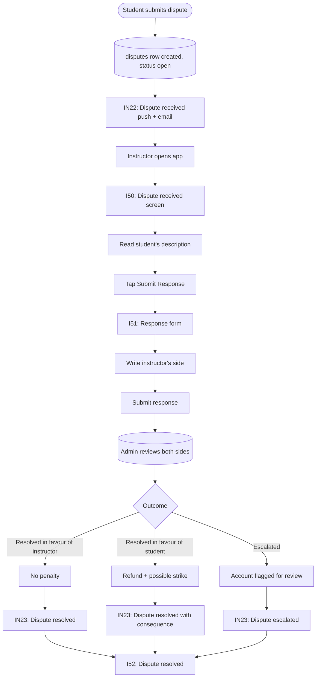
```mermaid
flowchart TD
  Trigger([Student submits dispute]) --> Create[(disputes row created, status open)]
  Create --> IN22[IN22: Dispute received push + email]
  IN22 --> Open[Instructor opens app]
  Open --> I50[I50: Dispute received screen]
  I50 --> Read[Read student's description]
  Read --> Respond[Tap Submit Response]
  Respond --> I51[I51: Response form]
  I51 --> Write[Write instructor's side]
  Write --> Submit[Submit response]
  Submit --> AdminReview[(Admin reviews both sides)]
  AdminReview --> Decision{Outcome}
  Decision -->|Resolved in favour of instructor| ResolveI[No penalty]
  Decision -->|Resolved in favour of student| ResolveS[Refund + possible strike]
  Decision -->|Escalated| EscalateAction[Account flagged for review]
  ResolveI --> IN23a[IN23: Dispute resolved]
  ResolveS --> IN23b[IN23: Dispute resolved with consequence]
  EscalateAction --> IN23c[IN23: Dispute escalated]
  IN23a --> I52[I52: Dispute resolved]
  IN23b --> I52
  IN23c --> I52
```

---

### 5.16 Home Dashboard Day in the Life

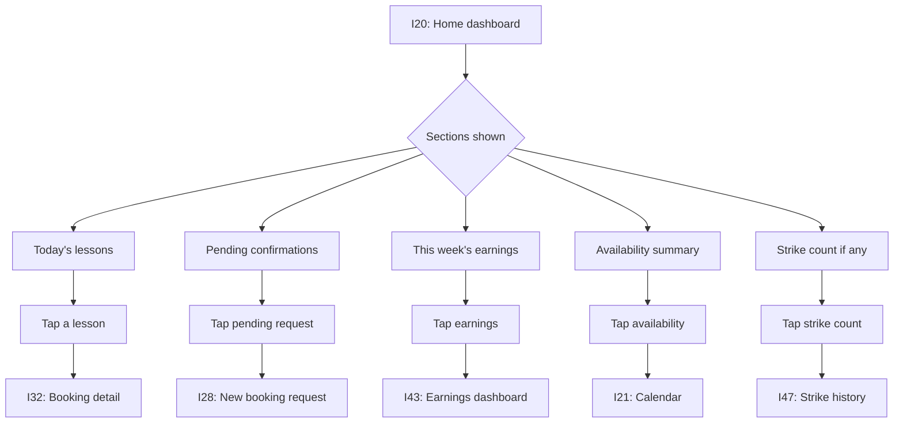
```mermaid
flowchart TD
  I20[I20: Home dashboard] --> Sections{Sections shown}
  Sections --> Today[Today's lessons]
  Sections --> Pending[Pending confirmations]
  Sections --> Earnings[This week's earnings]
  Sections --> Avail[Availability summary]
  Sections --> Strikes[Strike count if any]
  Today --> TapToday[Tap a lesson]
  TapToday --> I32[I32: Booking detail]
  Pending --> TapPending[Tap pending request]
  TapPending --> I28[I28: New booking request]
  Earnings --> TapEarnings[Tap earnings]
  TapEarnings --> I43[I43: Earnings dashboard]
  Avail --> TapAvail[Tap availability]
  TapAvail --> I21[I21: Calendar]
  Strikes --> TapStrike[Tap strike count]
  TapStrike --> I47[I47: Strike history]
```

---

### 5.17 Account Settings

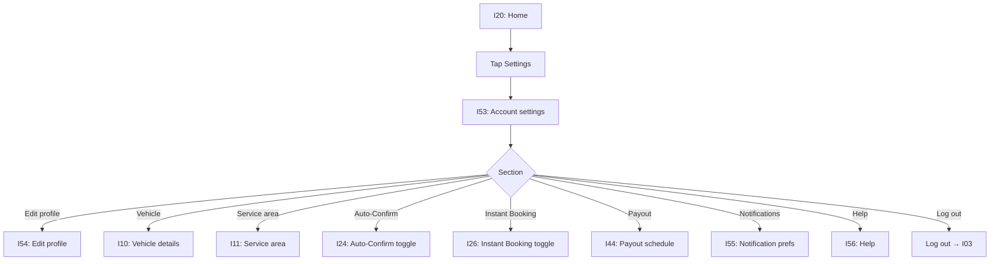
```mermaid
flowchart TD
  I20[I20: Home] --> Tap[Tap Settings]
  Tap --> I53[I53: Account settings]
  I53 --> Options{Section}
  Options -->|Edit profile| I54[I54: Edit profile]
  Options -->|Vehicle| I10[I10: Vehicle details]
  Options -->|Service area| I11[I11: Service area]
  Options -->|Auto-Confirm| I24[I24: Auto-Confirm toggle]
  Options -->|Instant Booking| I26[I26: Instant Booking toggle]
  Options -->|Payout| I44[I44: Payout schedule]
  Options -->|Notifications| I55[I55: Notification prefs]
  Options -->|Help| I56[I56: Help]
  Options -->|Log out| Logout[Log out → I03]
```

---

### 5.18 Empty States and Error States

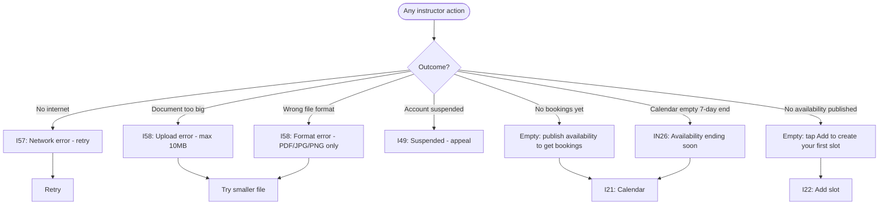
```mermaid
flowchart TD
  Action([Any instructor action]) --> Result{Outcome?}
  Result -->|No internet| I57[I57: Network error - retry]
  Result -->|Document too big| I58a[I58: Upload error - max 10MB]
  Result -->|Wrong file format| I58b[I58: Format error - PDF/JPG/PNG only]
  Result -->|Account suspended| I49[I49: Suspended - appeal]
  Result -->|No bookings yet| EmptyBookings[Empty: publish availability to get bookings]
  Result -->|No availability published| EmptyAvail[Empty: tap Add to create your first slot]
  Result -->|Calendar empty 7-day end| IN26[IN26: Availability ending soon]
  EmptyAvail --> I22[I22: Add slot]
  EmptyBookings --> I21[I21: Calendar]
  IN26 --> I21
  I57 --> Retry[Retry]
  I58a --> Reupload[Try smaller file]
  I58b --> Reupload
```

---

## 6. Behavioural Differences By Persona

| Persona | Auto-Confirm? | Instant Booking? | Typical strike risk |
|---|---|---|---|
| Michael (8 yrs, established) | Likely ON | Likely OFF (prefers planning) | Very low |
| Sandeep (5 yrs, growing) | OFF then ON | OFF initially, ON after confidence | Low - careful with bookings |
| Reza (15 yrs, premium) | OFF (selective) | OFF (full calendar) | Very low - selective accepter |

---

## 7. Open Items for Design Phase

- Welcome carousel content for instructor pitch (what 3 slides?)
- Onboarding tone — encouraging vs strict?
- Strike screen tone — punitive or coaching?
- Earnings visualization (bar chart, list, both?)
- Calendar UI for highlighted auto-confirmed bookings (per Don's note - green highlight)
- Document upload UX (camera in-app or file picker?)
- Booking request urgency UX (sound, vibration, fullscreen alert?)
- Strike severity escalation visuals
- Dispute response form scope (free text, multi-choice, file upload?)

---

## 8. Summary

The instructor journey covers **58 distinct screens** and **26 notification events** across **18 feature flows**. Every flow respects the locked Phase 1 rules.

This document, paired with `DriveBook_Student_Journey.md`, defines the complete consumer surface of DriveBook. The Master document (`DriveBook_Master_User_Journey.md`) shows how the two journeys interconnect at handoff moments.

---

*DriveBook Instructor Journey v1.0*
