# DriveBook — Master User Journey

**Version:** 1.0
**Status:** Active
**Last updated:** June 2026

> This document maps how the Student and Instructor journeys interconnect.
> It is the source of truth for every handoff moment in the DriveBook marketplace —
> the points where one party's action triggers an effect on the other party,
> mediated by the backend services.
>
> Read alongside `DriveBook_Student_Journey.md`, `DriveBook_Instructor_Journey.md`,
> `DriveBook_Cancellation_and_Confirmation_Policy.md`, `PRD.md`, and `ARCHITECTURE.md`.

---

## 1. Overview

DriveBook is a two-sided marketplace. Every booking is a chain of events that crosses from student → backend → instructor → backend → student. This document captures those chains.

There are nine major handoff sequences in the platform:

1. **Booking creation handoff** — Student books → Instructor confirms or auto-confirms
2. **Pre-lesson handoff** — Reminders fire to both sides on schedule
3. **2-hour check-in handoff** — Instructor confirms en route → Student notified
4. **Lesson execution handoff** — Pickup → lesson → completion
5. **Rating handoff** — Student rates → Instructor profile updates
6. **Cancellation handoff (student-initiated)** — Penalty applied → Instructor compensated
7. **Cancellation handoff (instructor-initiated)** — Refund + credit → Strike applied
8. **Strike handoff** — Triggers accumulate → Instructor visibility changes
9. **Dispute handoff** — Three-party flow involving admin

Each is mapped below with swim-lane and sequence diagrams.

---

## 2. The Marketplace at a Glance

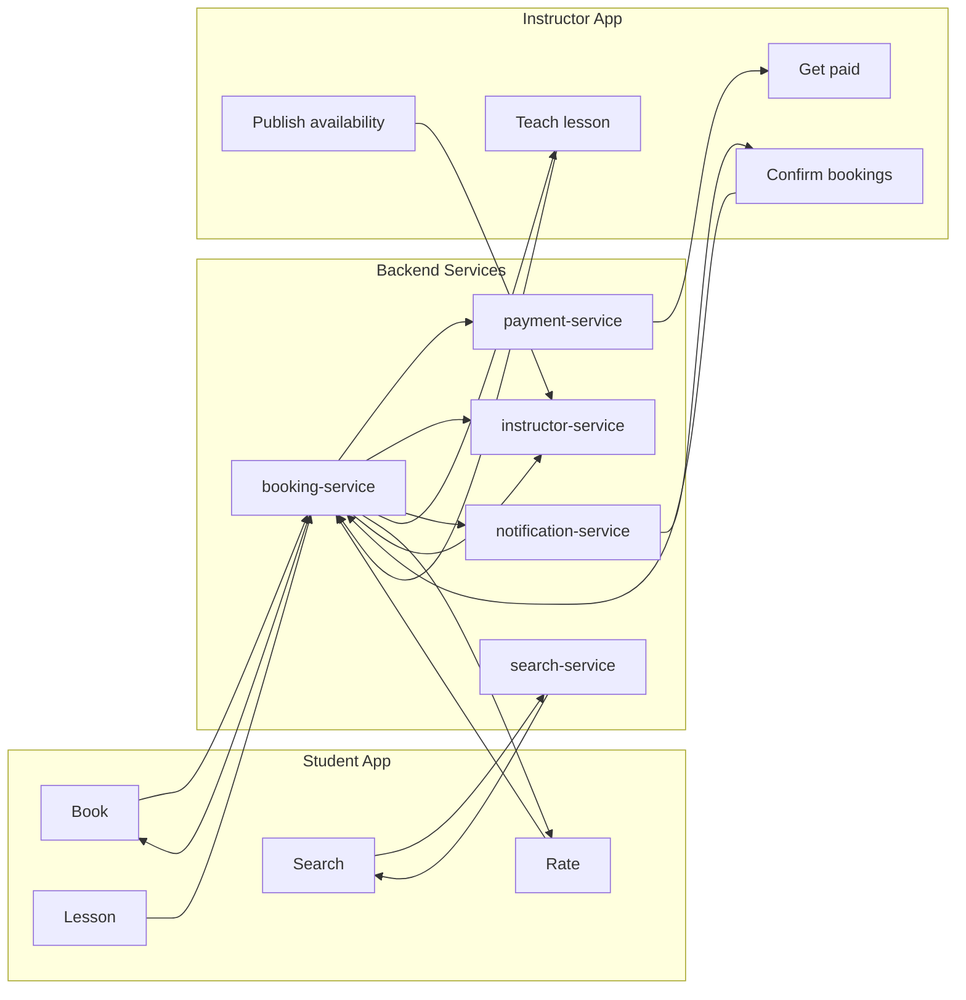
```mermaid
flowchart LR
  subgraph STUDENT[Student App]
    S1[Search]
    S2[Book]
    S3[Lesson]
    S4[Rate]
  end
  subgraph BACKEND[Backend Services]
    B1[search-service]
    B2[booking-service]
    B3[payment-service]
    B4[notification-service]
    B5[instructor-service]
  end
  subgraph INSTRUCTOR[Instructor App]
    I1[Publish availability]
    I2[Confirm bookings]
    I3[Teach lesson]
    I4[Get paid]
  end
  S1 --> B1
  B1 --> S1
  S2 --> B2
  B2 --> B3
  B2 --> B5
  B2 --> B4
  B4 --> I2
  I1 --> B5
  I2 --> B2
  B2 --> S2
  B2 --> I3
  S3 --> B2
  I3 --> B2
  B2 --> S4
  S4 --> B2
  B2 --> B5
  B3 --> I4
```

---

## 3. Handoff 1 — Booking Creation (Standard, Manual Confirm)

This is the most common handoff. A student books a slot, the instructor receives the request in manual mode and has 1 hour to respond.

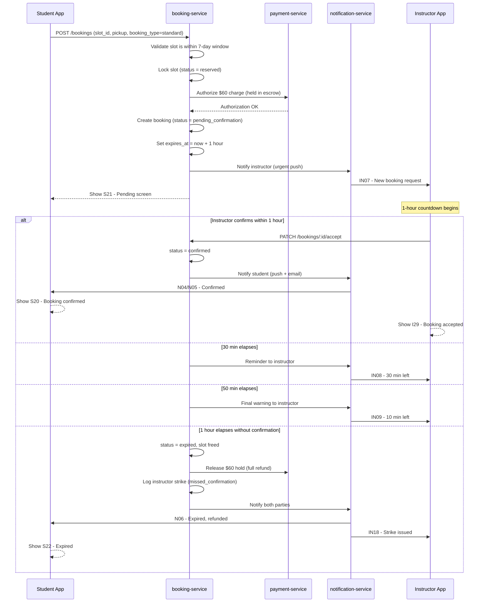
```mermaid
sequenceDiagram
  participant S as Student App
  participant BS as booking-service
  participant PS as payment-service
  participant NS as notification-service
  participant I as Instructor App

  S->>BS: POST /bookings (slot_id, pickup, booking_type=standard)
  BS->>BS: Validate slot is within 7-day window
  BS->>BS: Lock slot (status = reserved)
  BS->>PS: Authorize $60 charge (held in escrow)
  PS-->>BS: Authorization OK
  BS->>BS: Create booking (status = pending_confirmation)
  BS->>BS: Set expires_at = now + 1 hour
  BS->>NS: Notify instructor (urgent push)
  NS->>I: IN07 - New booking request
  BS-->>S: Show S21 - Pending screen
  
  Note over I: 1-hour countdown begins
  
  alt Instructor confirms within 1 hour
    I->>BS: PATCH /bookings/:id/accept
    BS->>BS: status = confirmed
    BS->>NS: Notify student (push + email)
    NS->>S: N04/N05 - Confirmed
    S-->>S: Show S20 - Booking confirmed
    I-->>I: Show I29 - Booking accepted
  else 30 min elapses
    BS->>NS: Reminder to instructor
    NS->>I: IN08 - 30 min left
  else 50 min elapses
    BS->>NS: Final warning to instructor
    NS->>I: IN09 - 10 min left
  else 1 hour elapses without confirmation
    BS->>BS: status = expired, slot freed
    BS->>PS: Release $60 hold (full refund)
    BS->>BS: Log instructor strike (missed_confirmation)
    BS->>NS: Notify both parties
    NS->>S: N06 - Expired, refunded
    NS->>I: IN18 - Strike issued
    S-->>S: Show S22 - Expired
  end
```

---

## 4. Handoff 2 — Booking Creation (Standard, Auto-Confirm ON)

When the instructor has Auto-Confirm enabled, the booking confirms instantly with no race.

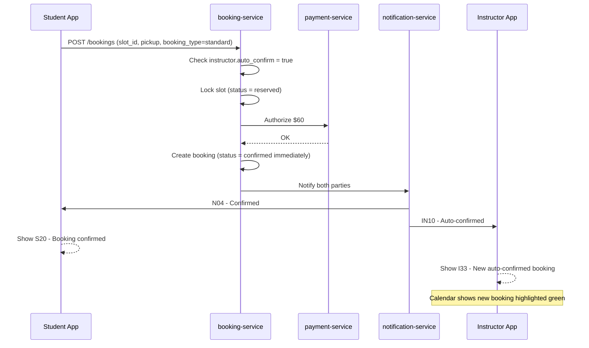
```mermaid
sequenceDiagram
  participant S as Student App
  participant BS as booking-service
  participant PS as payment-service
  participant NS as notification-service
  participant I as Instructor App

  S->>BS: POST /bookings (slot_id, pickup, booking_type=standard)
  BS->>BS: Check instructor.auto_confirm = true
  BS->>BS: Lock slot (status = reserved)
  BS->>PS: Authorize $60
  PS-->>BS: OK
  BS->>BS: Create booking (status = confirmed immediately)
  BS->>NS: Notify both parties
  NS->>S: N04 - Confirmed
  NS->>I: IN10 - Auto-confirmed
  S-->>S: Show S20 - Booking confirmed
  I-->>I: Show I33 - New auto-confirmed booking
  
  Note over I: Calendar shows new booking highlighted green
```

---

## 5. Handoff 3 — Booking Creation (Instant Booking)

Instant Booking has the most complex handoff because of the traffic check and immediate check-in.

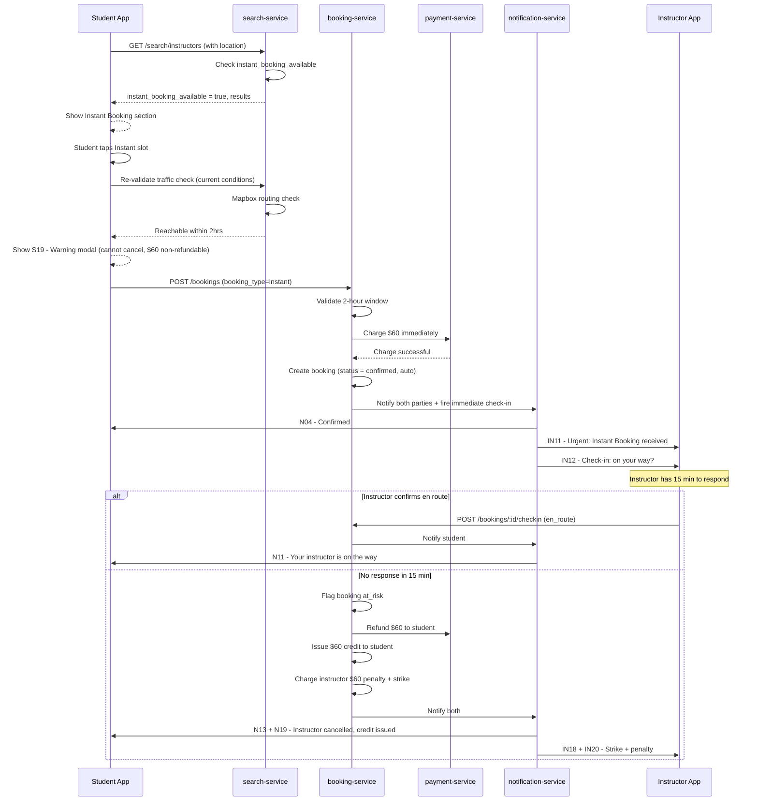
```mermaid
sequenceDiagram
  participant S as Student App
  participant SS as search-service
  participant BS as booking-service
  participant PS as payment-service
  participant NS as notification-service
  participant I as Instructor App

  S->>SS: GET /search/instructors (with location)
  SS->>SS: Check instant_booking_available
  SS-->>S: instant_booking_available = true, results
  S-->>S: Show Instant Booking section
  
  S->>S: Student taps Instant slot
  S->>SS: Re-validate traffic check (current conditions)
  SS->>SS: Mapbox routing check
  SS-->>S: Reachable within 2hrs
  S-->>S: Show S19 - Warning modal (cannot cancel, $60 non-refundable)
  
  S->>BS: POST /bookings (booking_type=instant)
  BS->>BS: Validate 2-hour window
  BS->>PS: Charge $60 immediately
  PS-->>BS: Charge successful
  BS->>BS: Create booking (status = confirmed, auto)
  BS->>NS: Notify both parties + fire immediate check-in
  NS->>S: N04 - Confirmed
  NS->>I: IN11 - Urgent: Instant Booking received
  NS->>I: IN12 - Check-in: on your way?
  
  Note over I: Instructor has 15 min to respond
  
  alt Instructor confirms en route
    I->>BS: POST /bookings/:id/checkin (en_route)
    BS->>NS: Notify student
    NS->>S: N11 - Your instructor is on the way
  else No response in 15 min
    BS->>BS: Flag booking at_risk
    BS->>PS: Refund $60 to student
    BS->>BS: Issue $60 credit to student
    BS->>BS: Charge instructor $60 penalty + strike
    BS->>NS: Notify both
    NS->>S: N13 + N19 - Instructor cancelled, credit issued
    NS->>I: IN18 + IN20 - Strike + penalty
  end
```

---

## 6. Handoff 4 — Pre-Lesson Reminder Cadence

This handoff happens in the background — both parties receive synchronized notifications driven by `booking-service` crons.

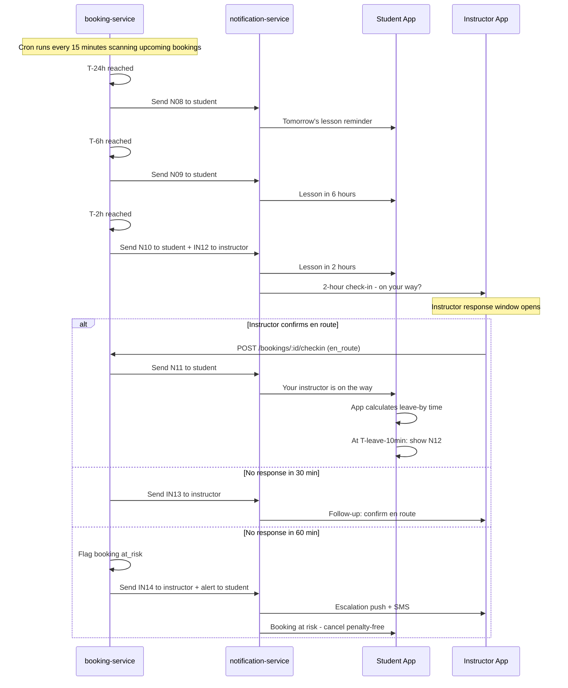
```mermaid
sequenceDiagram
  participant BS as booking-service
  participant NS as notification-service
  participant S as Student App
  participant I as Instructor App

  Note over BS: Cron runs every 15 minutes scanning upcoming bookings
  
  BS->>BS: T-24h reached
  BS->>NS: Send N08 to student
  NS->>S: Tomorrow's lesson reminder
  
  BS->>BS: T-6h reached
  BS->>NS: Send N09 to student
  NS->>S: Lesson in 6 hours
  
  BS->>BS: T-2h reached
  BS->>NS: Send N10 to student + IN12 to instructor
  NS->>S: Lesson in 2 hours
  NS->>I: 2-hour check-in - on your way?
  
  Note over I: Instructor response window opens
  
  alt Instructor confirms en route
    I->>BS: POST /bookings/:id/checkin (en_route)
    BS->>NS: Send N11 to student
    NS->>S: Your instructor is on the way
    S->>S: App calculates leave-by time
    S->>S: At T-leave-10min: show N12
  else No response in 30 min
    BS->>NS: Send IN13 to instructor
    NS->>I: Follow-up: confirm en route
  else No response in 60 min
    BS->>BS: Flag booking at_risk
    BS->>NS: Send IN14 to instructor + alert to student
    NS->>I: Escalation push + SMS
    NS->>S: Booking at risk - cancel penalty-free
  end
```

---

## 7. Handoff 5 — Lesson Execution and Completion

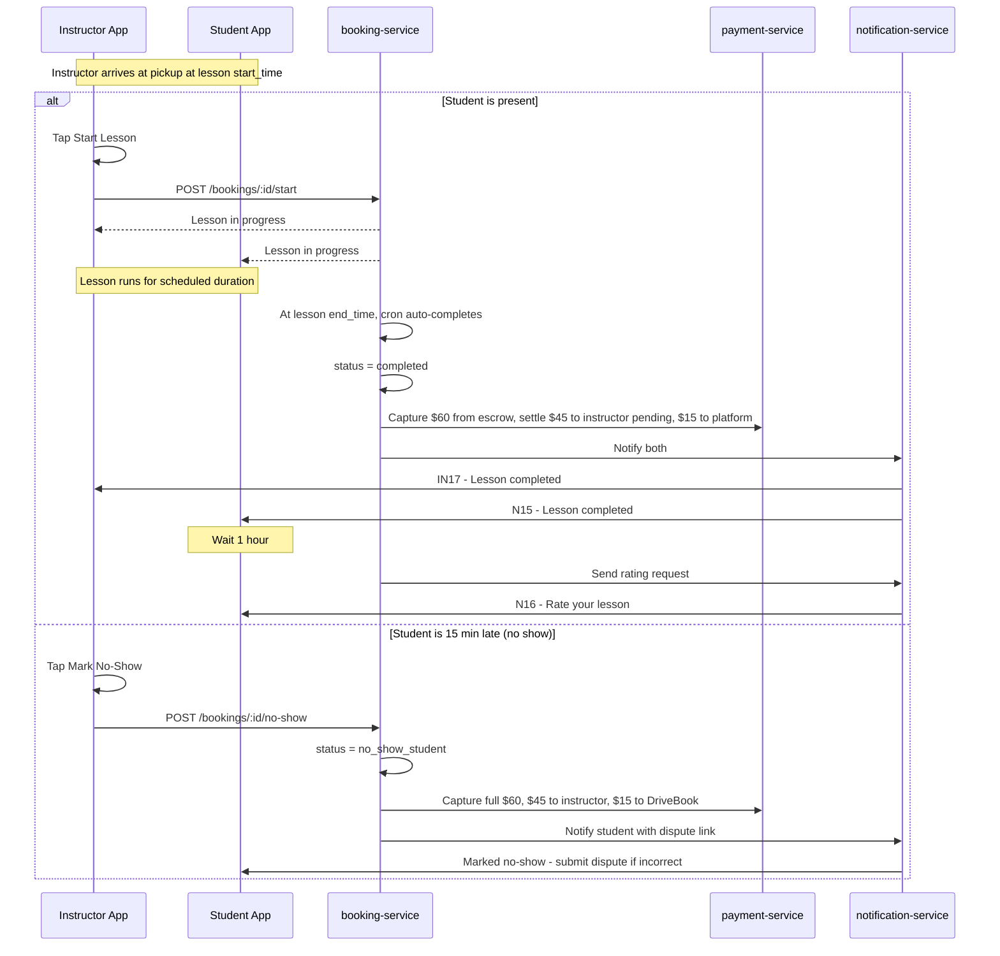
```mermaid
sequenceDiagram
  participant I as Instructor App
  participant S as Student App
  participant BS as booking-service
  participant PS as payment-service
  participant NS as notification-service

  Note over I,S: Instructor arrives at pickup at lesson start_time
  
  alt Student is present
    I->>I: Tap Start Lesson
    I->>BS: POST /bookings/:id/start
    BS-->>I: Lesson in progress
    BS-->>S: Lesson in progress
    
    Note over I,S: Lesson runs for scheduled duration
    
    BS->>BS: At lesson end_time, cron auto-completes
    BS->>BS: status = completed
    BS->>PS: Capture $60 from escrow, settle $45 to instructor pending, $15 to platform
    BS->>NS: Notify both
    NS->>I: IN17 - Lesson completed
    NS->>S: N15 - Lesson completed
    
    Note over S: Wait 1 hour
    
    BS->>NS: Send rating request
    NS->>S: N16 - Rate your lesson
  else Student is 15 min late (no show)
    I->>I: Tap Mark No-Show
    I->>BS: POST /bookings/:id/no-show
    BS->>BS: status = no_show_student
    BS->>PS: Capture full $60, $45 to instructor, $15 to DriveBook
    BS->>NS: Notify student with dispute link
    NS->>S: Marked no-show - submit dispute if incorrect
  end
```

---

## 8. Handoff 6 — Rating Submission

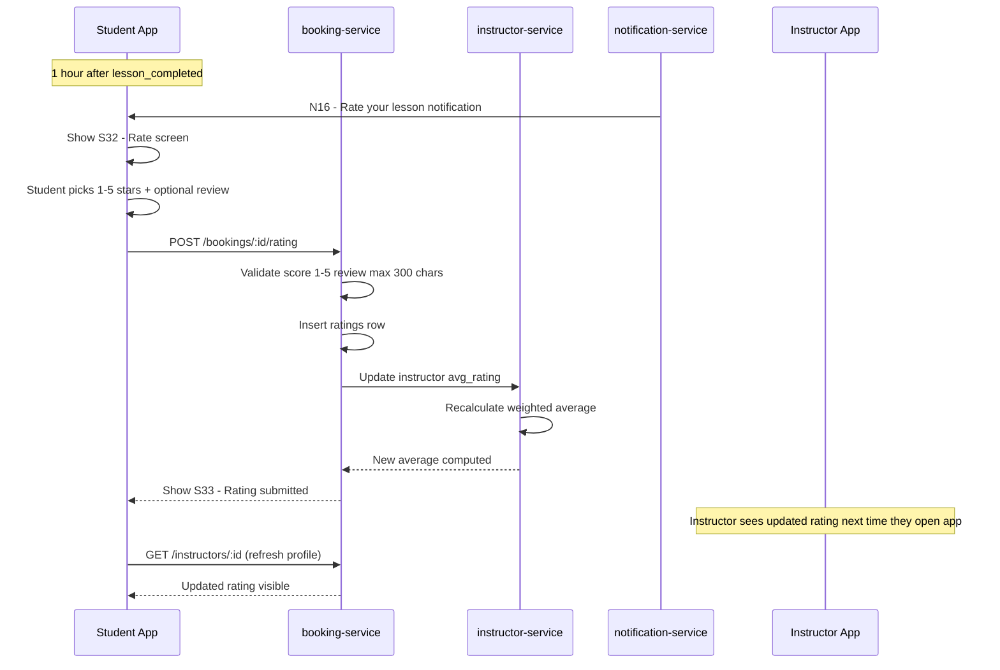
```mermaid
sequenceDiagram
  participant S as Student App
  participant BS as booking-service
  participant IS as instructor-service
  participant NS as notification-service
  participant I as Instructor App

  Note over S: 1 hour after lesson_completed
  
  NS->>S: N16 - Rate your lesson notification
  S->>S: Show S32 - Rate screen
  S->>S: Student picks 1-5 stars + optional review
  S->>BS: POST /bookings/:id/rating
  BS->>BS: Validate score 1-5 review max 300 chars
  BS->>BS: Insert ratings row
  BS->>IS: Update instructor avg_rating
  IS->>IS: Recalculate weighted average
  IS-->>BS: New average computed
  BS-->>S: Show S33 - Rating submitted
  
  Note over I: Instructor sees updated rating next time they open app
  
  S->>BS: GET /instructors/:id (refresh profile)
  BS-->>S: Updated rating visible
```

---

## 9. Handoff 7 — Student Cancellation

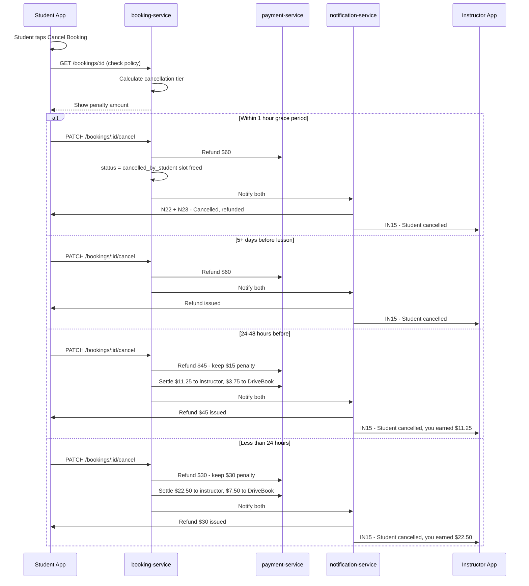
```mermaid
sequenceDiagram
  participant S as Student App
  participant BS as booking-service
  participant PS as payment-service
  participant NS as notification-service
  participant I as Instructor App

  S->>S: Student taps Cancel Booking
  S->>BS: GET /bookings/:id (check policy)
  BS->>BS: Calculate cancellation tier
  BS-->>S: Show penalty amount
  
  alt Within 1 hour grace period
    S->>BS: PATCH /bookings/:id/cancel
    BS->>PS: Refund $60
    BS->>BS: status = cancelled_by_student slot freed
    BS->>NS: Notify both
    NS->>S: N22 + N23 - Cancelled, refunded
    NS->>I: IN15 - Student cancelled
  else 5+ days before lesson
    S->>BS: PATCH /bookings/:id/cancel
    BS->>PS: Refund $60
    BS->>NS: Notify both
    NS->>S: Refund issued
    NS->>I: IN15 - Student cancelled
  else 24-48 hours before
    S->>BS: PATCH /bookings/:id/cancel
    BS->>PS: Refund $45 - keep $15 penalty
    BS->>PS: Settle $11.25 to instructor, $3.75 to DriveBook
    BS->>NS: Notify both
    NS->>S: Refund $45 issued
    NS->>I: IN15 - Student cancelled, you earned $11.25
  else Less than 24 hours
    S->>BS: PATCH /bookings/:id/cancel
    BS->>PS: Refund $30 - keep $30 penalty
    BS->>PS: Settle $22.50 to instructor, $7.50 to DriveBook
    BS->>NS: Notify both
    NS->>S: Refund $30 issued
    NS->>I: IN15 - Student cancelled, you earned $22.50
  end
```

---

## 10. Handoff 8 — Instructor Cancellation

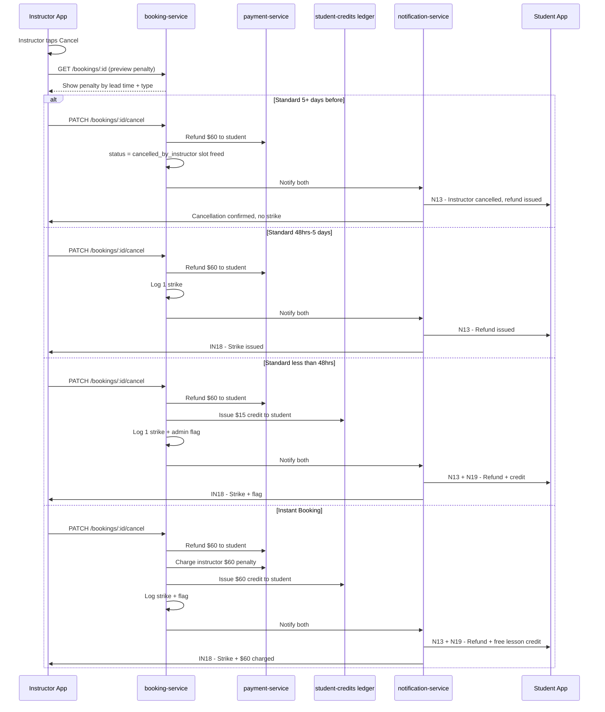
```mermaid
sequenceDiagram
  participant I as Instructor App
  participant BS as booking-service
  participant PS as payment-service
  participant SCS as student-credits ledger
  participant NS as notification-service
  participant S as Student App

  I->>I: Instructor taps Cancel
  I->>BS: GET /bookings/:id (preview penalty)
  BS-->>I: Show penalty by lead time + type
  
  alt Standard 5+ days before
    I->>BS: PATCH /bookings/:id/cancel
    BS->>PS: Refund $60 to student
    BS->>BS: status = cancelled_by_instructor slot freed
    BS->>NS: Notify both
    NS->>S: N13 - Instructor cancelled, refund issued
    NS->>I: Cancellation confirmed, no strike
  else Standard 48hrs-5 days
    I->>BS: PATCH /bookings/:id/cancel
    BS->>PS: Refund $60 to student
    BS->>BS: Log 1 strike
    BS->>NS: Notify both
    NS->>S: N13 - Refund issued
    NS->>I: IN18 - Strike issued
  else Standard less than 48hrs
    I->>BS: PATCH /bookings/:id/cancel
    BS->>PS: Refund $60 to student
    BS->>SCS: Issue $15 credit to student
    BS->>BS: Log 1 strike + admin flag
    BS->>NS: Notify both
    NS->>S: N13 + N19 - Refund + credit
    NS->>I: IN18 - Strike + flag
  else Instant Booking
    I->>BS: PATCH /bookings/:id/cancel
    BS->>PS: Refund $60 to student
    BS->>PS: Charge instructor $60 penalty
    BS->>SCS: Issue $60 credit to student
    BS->>BS: Log strike + flag
    BS->>NS: Notify both
    NS->>S: N13 + N19 - Refund + free lesson credit
    NS->>I: IN18 - Strike + $60 charged
  end
```

---

## 11. Handoff 9 — Strike Progression and Impact on Search

The strike system is mostly instructor-facing, but it directly affects student-facing search results.

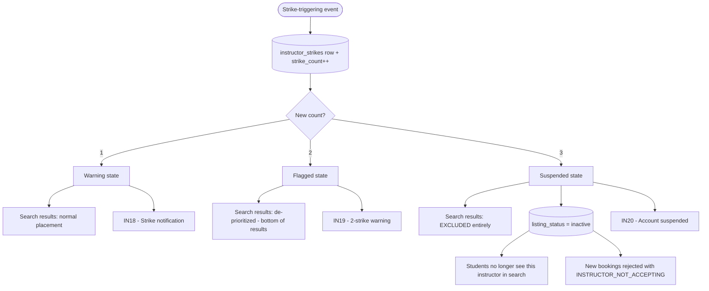
```mermaid
flowchart TD
  Trigger([Strike-triggering event]) --> Log[(instructor_strikes row + strike_count++)]
  Log --> Count{New count?}
  Count -->|1| State1[Warning state]
  Count -->|2| State2[Flagged state]
  Count -->|3| State3[Suspended state]
  
  State1 --> SearchEffect1[Search results: normal placement]
  State2 --> SearchEffect2[Search results: de-prioritized - bottom of results]
  State3 --> SearchEffect3[Search results: EXCLUDED entirely]
  
  State3 --> ListingStatus[(listing_status = inactive)]
  ListingStatus --> StudentImpact[Students no longer see this instructor in search]
  ListingStatus --> BookingBlock[New bookings rejected with INSTRUCTOR_NOT_ACCEPTING]
  
  State1 --> Notif1[IN18 - Strike notification]
  State2 --> Notif2[IN19 - 2-strike warning]
  State3 --> Notif3[IN20 - Account suspended]
```

---

## 12. Handoff 10 — Dispute Three-Way Flow

Disputes are the only flow that involves three parties: student, instructor, and admin.

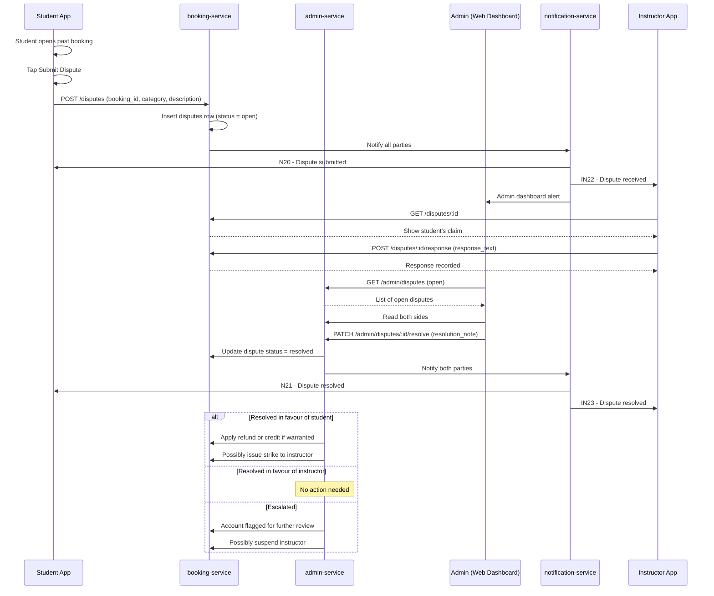
```mermaid
sequenceDiagram
  participant S as Student App
  participant BS as booking-service
  participant AS as admin-service
  participant Admin as Admin (Web Dashboard)
  participant NS as notification-service
  participant I as Instructor App

  S->>S: Student opens past booking
  S->>S: Tap Submit Dispute
  S->>BS: POST /disputes (booking_id, category, description)
  BS->>BS: Insert disputes row (status = open)
  BS->>NS: Notify all parties
  NS->>S: N20 - Dispute submitted
  NS->>I: IN22 - Dispute received
  NS->>Admin: Admin dashboard alert
  
  I->>BS: GET /disputes/:id
  BS-->>I: Show student's claim
  I->>BS: POST /disputes/:id/response (response_text)
  BS-->>I: Response recorded
  
  Admin->>AS: GET /admin/disputes (open)
  AS-->>Admin: List of open disputes
  Admin->>AS: Read both sides
  Admin->>AS: PATCH /admin/disputes/:id/resolve (resolution_note)
  AS->>BS: Update dispute status = resolved
  AS->>NS: Notify both parties
  NS->>S: N21 - Dispute resolved
  NS->>I: IN23 - Dispute resolved
  
  alt Resolved in favour of student
    AS->>BS: Apply refund or credit if warranted
    AS->>BS: Possibly issue strike to instructor
  else Resolved in favour of instructor
    Note over AS: No action needed
  else Escalated
    AS->>BS: Account flagged for further review
    AS->>BS: Possibly suspend instructor
  end
```

---

## 13. Money Flow Visualization

This shows where each dollar goes for every booking outcome. All amounts in CAD.

### 13.1 Successful lesson — Standard or Instant

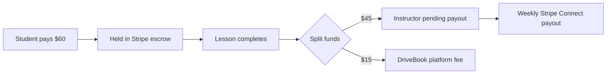
```mermaid
flowchart LR
  Student[Student pays $60] --> Escrow[Held in Stripe escrow]
  Escrow --> Lesson[Lesson completes]
  Lesson --> Split{Split funds}
  Split -->|$45| Instructor[Instructor pending payout]
  Split -->|$15| DriveBook[DriveBook platform fee]
  Instructor --> Weekly[Weekly Stripe Connect payout]
```

### 13.2 Student cancels within grace or 5+ days out

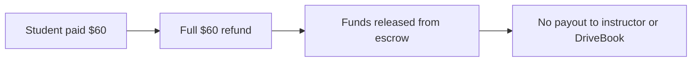
```mermaid
flowchart LR
  Student[Student paid $60] --> Refund[Full $60 refund]
  Refund --> Released[Funds released from escrow]
  Released --> Done[No payout to instructor or DriveBook]
```

### 13.3 Student cancels 24-48 hours before lesson

```mermaid
flowchart LR
  Student[Student paid $60] --> Split{Apply 25% penalty}
  Split -->|$45 refund| StudentBack[Returned to student]
  Split -->|$15 penalty| Distribute{Split penalty}
  Distribute -->|$11.25| InstructorEarn[Instructor]
  Distribute -->|$3.75| DriveBookEarn[DriveBook]
```

### 13.4 Student cancels less than 24 hours before lesson

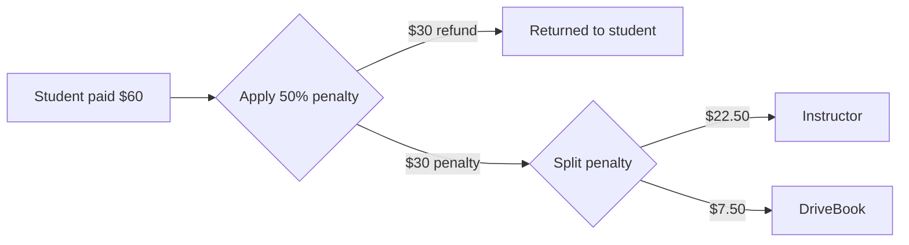
```mermaid
flowchart LR
  Student[Student paid $60] --> Split{Apply 50% penalty}
  Split -->|$30 refund| StudentBack[Returned to student]
  Split -->|$30 penalty| Distribute{Split penalty}
  Distribute -->|$22.50| InstructorEarn[Instructor]
  Distribute -->|$7.50| DriveBookEarn[DriveBook]
```

### 13.5 Instructor cancels Standard less than 48 hours before

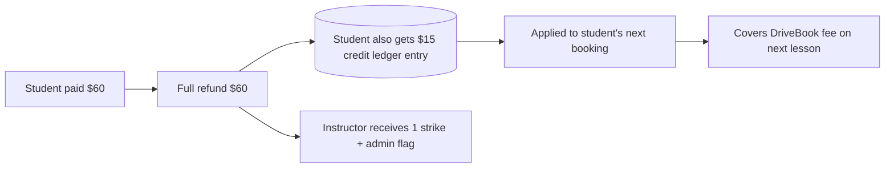
```mermaid
flowchart LR
  Student[Student paid $60] --> Refund[Full refund $60]
  Refund --> Credit[(Student also gets $15 credit ledger entry)]
  Refund --> Strike[Instructor receives 1 strike + admin flag]
  Credit --> FutureBook[Applied to student's next booking]
  FutureBook --> CoverFee[Covers DriveBook fee on next lesson]
```

### 13.6 Instructor cancels Instant Booking

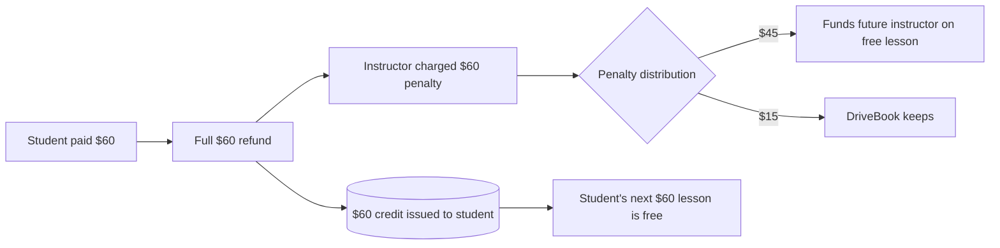
```mermaid
flowchart LR
  Student[Student paid $60] --> Refund[Full $60 refund]
  Refund --> Credit[($60 credit issued to student)]
  Refund --> Penalty[Instructor charged $60 penalty]
  Penalty --> Split{Penalty distribution}
  Split -->|$45| FutureInstr[Funds future instructor on free lesson]
  Split -->|$15| DriveBookKeep[DriveBook keeps]
  Credit --> FreeNext[Student's next $60 lesson is free]
```

### 13.7 Student no-show

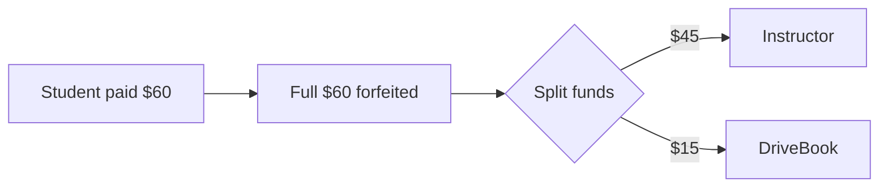
```mermaid
flowchart LR
  Student[Student paid $60] --> Forfeit[Full $60 forfeited]
  Forfeit --> Split{Split funds}
  Split -->|$45| Instructor[Instructor]
  Split -->|$15| DriveBook[DriveBook]
```

---

## 14. Notification Synchronization Map

Every event that touches both student and instructor simultaneously:

| Event | Student gets | Instructor gets |
|---|---|---|
| Booking confirmed | N04 push + email | IN10 push + email (if auto) |
| 24h reminder | N08 push + email | (none — own calendar) |
| 6h reminder | N09 push | (none) |
| 2h reminder | N10 push | IN12 check-in push |
| Instructor en route | N11 push | (confirmation in-app) |
| Leave in 10 min | N12 push | (none) |
| Lesson completed | N15 push | IN17 push |
| Rate your lesson | N16 push | (waits for rating) |
| Student cancels | N22 + N23 email | IN15 push + email |
| Instructor cancels | N13 push + email + SMS | (confirmation in-app) |
| Instructor strike | (none) | IN18 push + email |
| Dispute submitted | N20 email | IN22 push + email |
| Dispute resolved | N21 push + email | IN23 push + email |

---

## 15. State Synchronization Map

Every booking has a status that both parties see. This shows how status transitions affect each side.

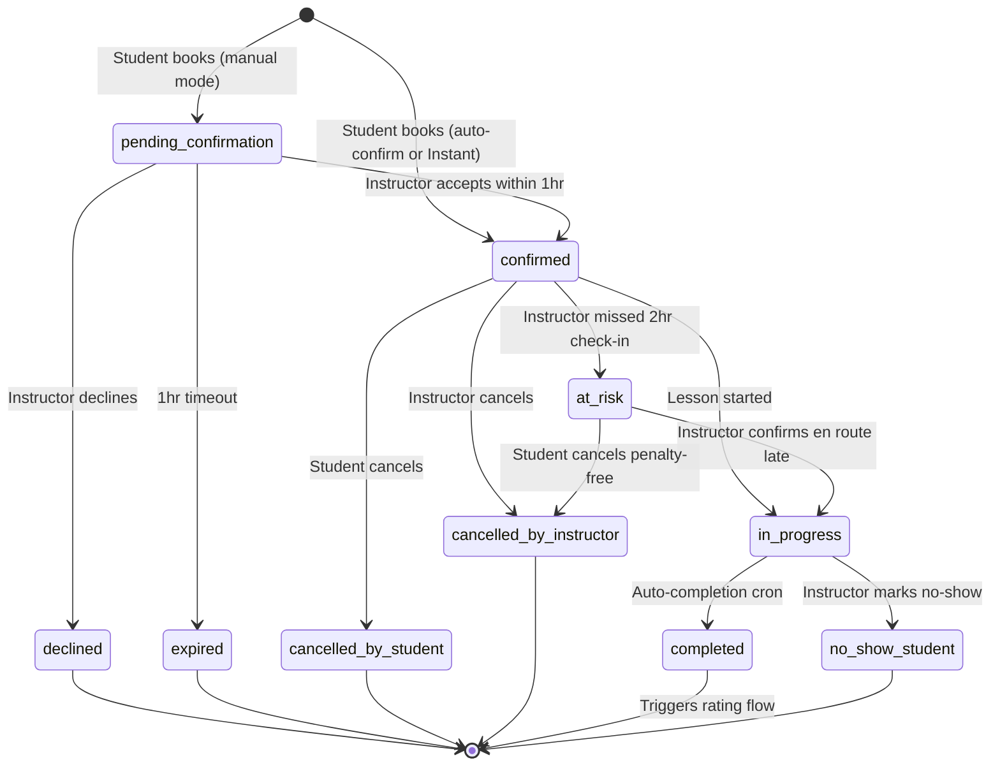
```mermaid
stateDiagram-v2
  [*] --> pending_confirmation: Student books (manual mode)
  [*] --> confirmed: Student books (auto-confirm or Instant)
  
  pending_confirmation --> confirmed: Instructor accepts within 1hr
  pending_confirmation --> declined: Instructor declines
  pending_confirmation --> expired: 1hr timeout
  
  confirmed --> at_risk: Instructor missed 2hr check-in
  confirmed --> cancelled_by_student: Student cancels
  confirmed --> cancelled_by_instructor: Instructor cancels
  confirmed --> in_progress: Lesson started
  
  at_risk --> in_progress: Instructor confirms en route late
  at_risk --> cancelled_by_instructor: Student cancels penalty-free
  
  in_progress --> completed: Auto-completion cron
  in_progress --> no_show_student: Instructor marks no-show
  
  declined --> [*]
  expired --> [*]
  cancelled_by_student --> [*]
  cancelled_by_instructor --> [*]
  completed --> [*]: Triggers rating flow
  no_show_student --> [*]
```

---

## 16. The 9 Critical Handoff Moments (Summary Table)

| # | Handoff | Trigger | Student sees | Instructor sees | Backend writes |
|---|---|---|---|---|---|
| 1 | Booking created (manual) | Student POST /bookings | S21 Pending | IN07 Push | booking.pending_confirmation |
| 2 | Booking auto-confirmed | POST /bookings + auto_confirm=true | S20 Confirmed | IN10 Push | booking.confirmed |
| 3 | Booking expired | 1-hour SLA passed | S22 Expired + refund | IN18 Strike | booking.expired + strike |
| 4 | Pre-lesson reminders | Cron at -24h/-6h/-2h | N08/N09/N10 | IN12 (at -2h) | (notifications_log only) |
| 5 | Instructor en route | POST /bookings/:id/checkin | N11 | I35 Confirmed | booking.instructor_en_route |
| 6 | Lesson completion | Cron at end_time | N15 + N16 | IN17 | booking.completed + payout pending |
| 7 | Rating submitted | POST /bookings/:id/rating | S33 | (visible in dashboard) | ratings + avg_rating updated |
| 8 | Cancellation | PATCH /bookings/:id/cancel | N22/N23 | IN15 (or own) | refund + possibly strike + credit |
| 9 | Dispute submitted | POST /disputes | N20 | IN22 | disputes.open |

---

## 17. Service Map by Handoff

Which services are involved in each handoff (helps Brother David understand what's wired to what).

| Handoff | booking | payment | search | instructor | notification | admin |
|---|---|---|---|---|---|---|
| 1. Manual booking | ✓ | ✓ |  | ✓ (verify) | ✓ |  |
| 2. Auto-confirm | ✓ | ✓ |  | ✓ | ✓ |  |
| 3. Instant booking | ✓ | ✓ | ✓ (traffic) | ✓ | ✓ |  |
| 4. Pre-lesson cron | ✓ |  |  |  | ✓ |  |
| 5. 2-hour check-in | ✓ |  |  |  | ✓ |  |
| 6. Lesson completion | ✓ | ✓ |  | ✓ (rating) | ✓ |  |
| 7. Rating | ✓ |  |  | ✓ (avg) | ✓ |  |
| 8. Cancellation | ✓ | ✓ |  | ✓ (strike) | ✓ |  |
| 9. Dispute | ✓ |  |  | ✓ (strike) | ✓ | ✓ |

---

## 18. Open Items for Design Phase

- Visual representation of the strike system to instructors (graph, counter, traffic light?)
- How student credits surface across the app (banner, profile section, checkout only?)
- Dispute response timeline visibility — does the instructor see a countdown?
- Auto-Confirm badge styling on instructor profile (lightning bolt, custom icon?)
- Notification urgency levels — visual differentiation between urgent (booking request, Instant), standard (reminders), and informational (rating reminder)
- Lesson day "you should be leaving now" UX — full screen alert vs banner vs push only?
- Three-way dispute UI — does the student see the instructor's response, or only the resolution?

---

## 19. Summary

DriveBook is, at its core, a series of synchronized handoffs between two parties mediated by backend services. This document maps each of those 9 handoffs in sequence-diagram form, captures the money flow, and surfaces the state and notification synchronization between the two journeys.

**Cross-references:**
- Screen-level student detail → `DriveBook_Student_Journey.md`
- Screen-level instructor detail → `DriveBook_Instructor_Journey.md`
- Policy detail → `DriveBook_Cancellation_and_Confirmation_Policy.md`
- Service contracts → `SERVICE_CONTRACTS.md`
- Architecture → `ARCHITECTURE.md`

This three-document set (Student + Instructor + Master) is the complete product-level specification of DriveBook. The PRD describes *what* DriveBook is. These journeys describe *what it feels like to use*.

---

*DriveBook Master User Journey v1.0*
