# DriveBook — Student Journey

**Version:** 1.0
**Status:** Active
**Last updated:** June 2026

> This document is the complete user-flow map of the DriveBook student mobile app.
> It is the source of truth for what a student sees, does, and experiences from
> first download through every possible interaction with the platform.
>
> Mermaid diagrams below can be imported into FigJam via the Mermaid Chart plugin
> or rendered at https://mermaid.live and dragged in as images.
>
> Read alongside `PRD.md`, `DriveBook_Cancellation_and_Confirmation_Policy.md`,
> and `DriveBook_Instructor_Journey.md`.

---

## 1. Overview

The student app is the primary customer-facing surface of DriveBook. It is a React Native + Expo mobile application available on iOS and Android. Students use it to find a verified Toronto driving instructor, book a lesson, get to their pickup point, take the lesson, rate the instructor, and re-book.

Every flow in this document follows the locked Phase 1 model:

- Fixed pricing: $60 lesson, $45 to instructor, $15 to DriveBook
- 7-day rolling booking window for Standard
- 2-hour minimum lead time for Instant Booking
- Cancellation policy per `DriveBook_Cancellation_and_Confirmation_Policy.md`

---

## 2. Student Personas

The flows in this document are tested against three student personas from the PRD:

| Persona | Snapshot | Primary need |
|---|---|---|
| **Alex** | 23, Scarborough, failed G2 once, speaks English + Mandarin | Mandarin-speaking instructor nearby, Saturday afternoons |
| **Priya** | 28, new arrival from India, takes transit, has international licence | Hindi-speaking instructor, pickup at subway station, online payment |
| **Marcus** | 31, busy professional, prepping for G road test, English only | Reliable booking, no last-minute cancellations, easy rescheduling |

---

## 3. Screen Inventory

Every distinct screen the student can land on, numbered for reference in diagrams.

| # | Screen | Purpose |
|---|---|---|
| S01 | Splash | App launch animation |
| S02 | Welcome carousel | 3 slides explaining DriveBook |
| S03 | Sign Up / Log In | Auth entry |
| S04 | Signup form | Email, password, name, phone |
| S05 | Email verification pending | "Check your email" screen |
| S06 | Login form | Email + password |
| S07 | Forgot password | Reset request |
| S08 | Profile setup | Phone, language pref, pickup area |
| S09 | Home (logged in) | Hero, Instant Booking section (conditional), search, recent instructors |
| S10 | Home (guest) | Browse-only mode, prompts to sign up at booking time |
| S11 | Search filters | Language, gender, area, price, rating, date range |
| S12 | Search results | List of instructor cards |
| S13 | Empty results | "No instructors match — widen your filters" |
| S14 | Instructor profile | Bio, rating, reviews, languages, vehicle, hourly rate, available slots |
| S15 | Slot picker | 7-day calendar with available times |
| S16 | Pickup pin map | Mapbox screen to drop pickup location |
| S17 | Booking review | Summary before payment |
| S18 | Payment | Stripe payment sheet |
| S19 | Instant Booking warning | Full-screen modal explaining no-cancel rule |
| S20 | Booking confirmed | Reference code, instructor details, pickup, time |
| S21 | Booking pending | "Waiting for instructor to confirm — within 1 hour" |
| S22 | Booking expired | Instructor didn't respond — refund issued |
| S23 | Booking declined | Instructor declined — refund issued |
| S24 | My Bookings | List view: Upcoming, Past |
| S25 | Booking detail | Single booking expanded view |
| S26 | Cancellation review | Penalty preview before confirming cancel |
| S27 | Cancellation confirmed | "Cancelled — refund of $X processing" |
| S28 | Pre-lesson screen | Lesson day at-a-glance with instructor ETA |
| S29 | Instructor en route | Live status: "Your instructor is on the way" |
| S30 | Leave now alert | "Leave in 10 minutes to reach pickup" |
| S31 | Lesson in progress | Static screen during lesson |
| S32 | Rate your lesson | 1-5 stars + optional review |
| S33 | Rating submitted | Thank you + suggestion to book again |
| S34 | Credits | List of available student credits |
| S35 | Dispute form | Submit a dispute about a booking |
| S36 | Dispute submitted | Confirmation screen with case ID |
| S37 | Account settings | Profile, payment methods, notifications, language |
| S38 | Edit profile | Name, phone, avatar |
| S39 | Payment methods | Saved cards |
| S40 | Notification preferences | Toggle push, email, SMS |
| S41 | Help / Support | FAQ + contact form |
| S42 | Error - network | "No connection — retry" |
| S43 | Error - payment | "Payment failed — try a different card" |
| S44 | Account suspended | If the student's account is flagged |

---

## 4. Notification Inventory

Every push, email, or SMS the student receives, with trigger and channel.

| # | Event | Trigger | Channel |
|---|---|---|---|
| N01 | Welcome | Account created | Email |
| N02 | Email verification | Signup | Email |
| N03 | Password reset | Forgot password tapped | Email |
| N04 | Booking confirmed | Standard or Instant confirmed | Push + Email |
| N05 | Booking pending → confirmed | Instructor accepted within 1hr | Push |
| N06 | Booking pending → expired | Instructor didn't respond | Push + Email |
| N07 | Booking pending → declined | Instructor declined | Push + Email |
| N08 | 24-hour reminder | 24 hours before lesson | Push + Email |
| N09 | 6-hour reminder | 6 hours before lesson | Push |
| N10 | 2-hour reminder | 2 hours before lesson | Push |
| N11 | Instructor en route | Instructor tapped "I'm on my way" | Push |
| N12 | Leave in 10 minutes | Calculated leave-by time | Push |
| N13 | Instructor cancelled | Instructor cancelled the booking | Push + Email + SMS |
| N14 | Booking flagged at-risk | Instructor missed 2hr check-in | Push |
| N15 | Lesson completed | Auto-completed after lesson end_time | Push |
| N16 | Rate your lesson | 1 hour after lesson completion | Push |
| N17 | Rating reminder | 24 hours later if not rated | Push |
| N18 | Credit applied | Credit used on a booking | Email |
| N19 | Credit earned | Credit awarded (instructor cancel) | Push + Email |
| N20 | Dispute submitted | Student submitted dispute | Email |
| N21 | Dispute resolved | Admin resolved dispute | Push + Email |
| N22 | Cancellation confirmed | Student cancelled their own booking | Email |
| N23 | Refund issued | Stripe refund processed | Email |

---

## 5. Flow Diagrams by Feature Area

### 5.1 First-Time App Open + Account Creation

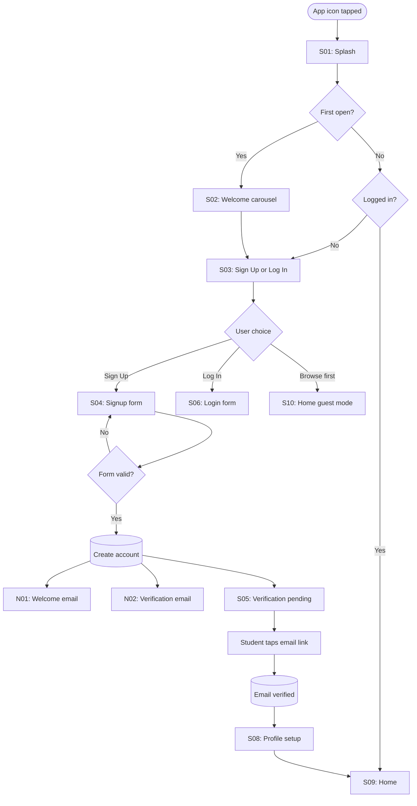
```mermaid
flowchart TD
  Start([App icon tapped]) --> S01[S01: Splash]
  S01 --> FirstTime{First open?}
  FirstTime -->|Yes| S02[S02: Welcome carousel]
  FirstTime -->|No| LoggedIn{Logged in?}
  LoggedIn -->|Yes| S09[S09: Home]
  LoggedIn -->|No| S03[S03: Sign Up or Log In]
  S02 --> S03
  S03 --> Choice{User choice}
  Choice -->|Sign Up| S04[S04: Signup form]
  Choice -->|Log In| S06[S06: Login form]
  Choice -->|Browse first| S10[S10: Home guest mode]
  S04 --> Validate{Form valid?}
  Validate -->|No| S04
  Validate -->|Yes| Submit[(Create account)]
  Submit --> N01[N01: Welcome email]
  Submit --> N02[N02: Verification email]
  Submit --> S05[S05: Verification pending]
  S05 --> TapLink[Student taps email link]
  TapLink --> Verified[(Email verified)]
  Verified --> S08[S08: Profile setup]
  S08 --> S09
```

---

### 5.2 Login + Forgot Password

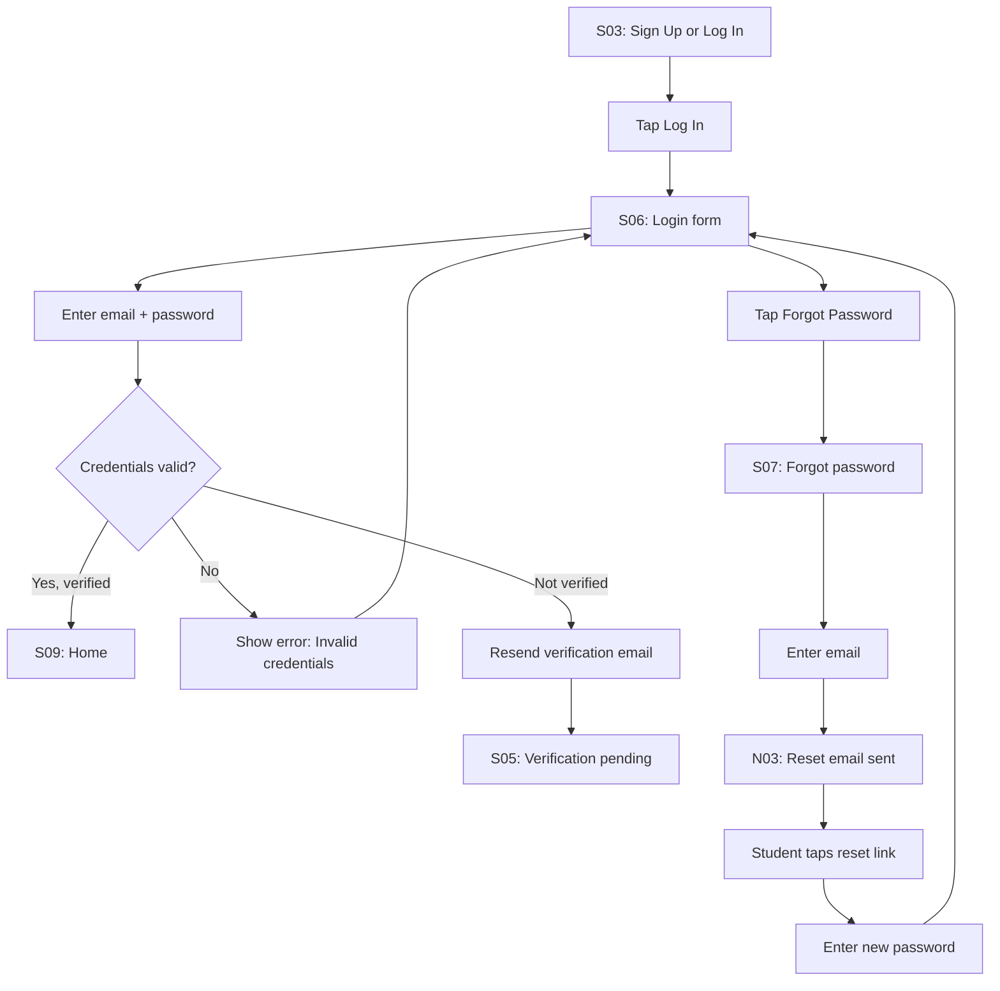
```mermaid
flowchart TD
  S03[S03: Sign Up or Log In] --> Tap[Tap Log In]
  Tap --> S06[S06: Login form]
  S06 --> Enter[Enter email + password]
  Enter --> Auth{Credentials valid?}
  Auth -->|Yes, verified| S09[S09: Home]
  Auth -->|No| Error[Show error: Invalid credentials]
  Auth -->|Not verified| Resend[Resend verification email]
  Error --> S06
  Resend --> S05[S05: Verification pending]
  S06 --> Forgot[Tap Forgot Password]
  Forgot --> S07[S07: Forgot password]
  S07 --> EnterEmail[Enter email]
  EnterEmail --> N03[N03: Reset email sent]
  N03 --> ResetLink[Student taps reset link]
  ResetLink --> NewPW[Enter new password]
  NewPW --> S06
```

---

### 5.3 Home Screen + Conditional Instant Booking Section

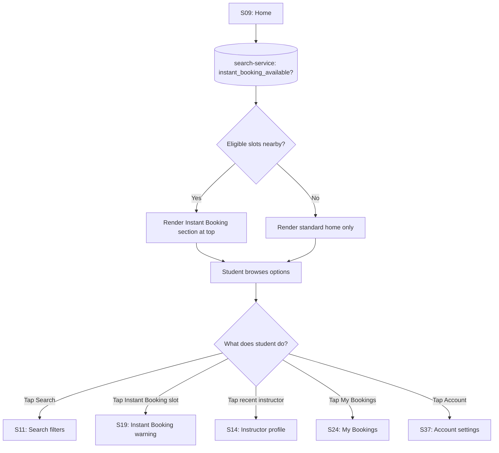
```mermaid
flowchart TD
  S09[S09: Home] --> Check[(search-service: instant_booking_available?)]
  Check --> Available{Eligible slots nearby?}
  Available -->|Yes| ShowInstant[Render Instant Booking section at top]
  Available -->|No| HideInstant[Render standard home only]
  ShowInstant --> Browse[Student browses options]
  HideInstant --> Browse
  Browse --> Action{What does student do?}
  Action -->|Tap Search| S11[S11: Search filters]
  Action -->|Tap Instant Booking slot| S19[S19: Instant Booking warning]
  Action -->|Tap recent instructor| S14[S14: Instructor profile]
  Action -->|Tap My Bookings| S24[S24: My Bookings]
  Action -->|Tap Account| S37[S37: Account settings]
```

---

### 5.4 Search + Filter

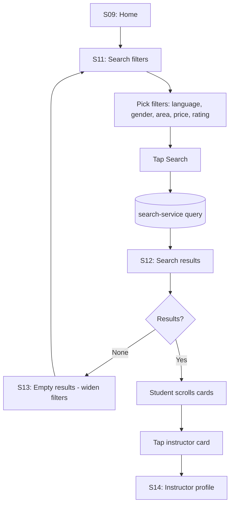
```mermaid
flowchart TD
  S09[S09: Home] --> S11[S11: Search filters]
  S11 --> Pick[Pick filters: language, gender, area, price, rating]
  Pick --> Submit[Tap Search]
  Submit --> Query[(search-service query)]
  Query --> S12[S12: Search results]
  S12 --> Empty{Results?}
  Empty -->|None| S13[S13: Empty results - widen filters]
  Empty -->|Yes| Scroll[Student scrolls cards]
  S13 --> S11
  Scroll --> Tap[Tap instructor card]
  Tap --> S14[S14: Instructor profile]
```

---

### 5.5 View Instructor Profile

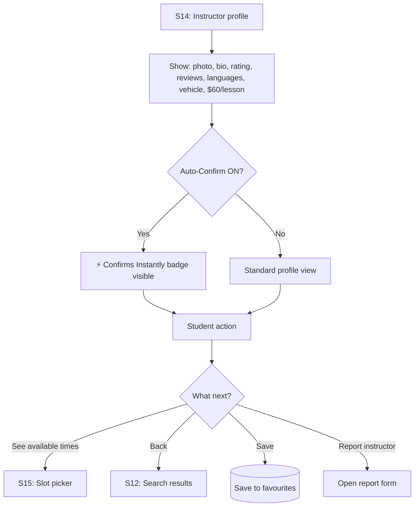
```mermaid
flowchart TD
  S14[S14: Instructor profile] --> Show[Show: photo, bio, rating, reviews, languages, vehicle, $60/lesson]
  Show --> Badge{Auto-Confirm ON?}
  Badge -->|Yes| ShowBadge[⚡ Confirms Instantly badge visible]
  Badge -->|No| Standard[Standard profile view]
  ShowBadge --> Action[Student action]
  Standard --> Action
  Action --> Choice{What next?}
  Choice -->|See available times| S15[S15: Slot picker]
  Choice -->|Back| S12[S12: Search results]
  Choice -->|Save| Save[(Save to favourites)]
  Choice -->|Report instructor| Report[Open report form]
```

---

### 5.6 Standard Booking Flow

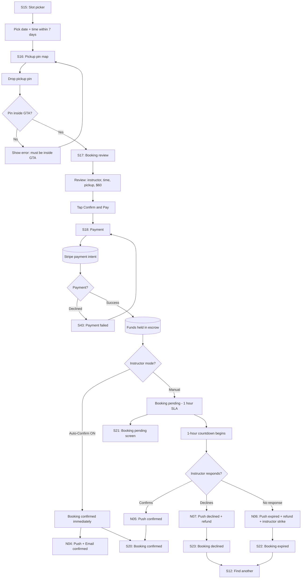
```mermaid
flowchart TD
  S15[S15: Slot picker] --> Pick[Pick date + time within 7 days]
  Pick --> S16[S16: Pickup pin map]
  S16 --> Drop[Drop pickup pin]
  Drop --> Valid{Pin inside GTA?}
  Valid -->|No| Error[Show error: must be inside GTA]
  Valid -->|Yes| S17[S17: Booking review]
  Error --> S16
  S17 --> Review[Review: instructor, time, pickup, $60]
  Review --> Confirm[Tap Confirm and Pay]
  Confirm --> S18[S18: Payment]
  S18 --> Stripe[(Stripe payment intent)]
  Stripe --> Result{Payment?}
  Result -->|Declined| S43[S43: Payment failed]
  Result -->|Success| HoldFunds[(Funds held in escrow)]
  S43 --> S18
  HoldFunds --> Mode{Instructor mode?}
  Mode -->|Auto-Confirm ON| AutoPath[Booking confirmed immediately]
  Mode -->|Manual| ManualPath[Booking pending - 1 hour SLA]
  AutoPath --> N04[N04: Push + Email confirmed]
  AutoPath --> S20[S20: Booking confirmed]
  ManualPath --> S21[S21: Booking pending screen]
  ManualPath --> SLA[1-hour countdown begins]
  SLA --> Response{Instructor responds?}
  Response -->|Confirms| N05[N05: Push confirmed]
  Response -->|Declines| N07[N07: Push declined + refund]
  Response -->|No response| N06[N06: Push expired + refund + instructor strike]
  N05 --> S20
  N07 --> S23[S23: Booking declined]
  N06 --> S22[S22: Booking expired]
  S23 --> S12[S12: Find another]
  S22 --> S12
```

---

### 5.7 Instant Booking Flow (with mandatory warning)

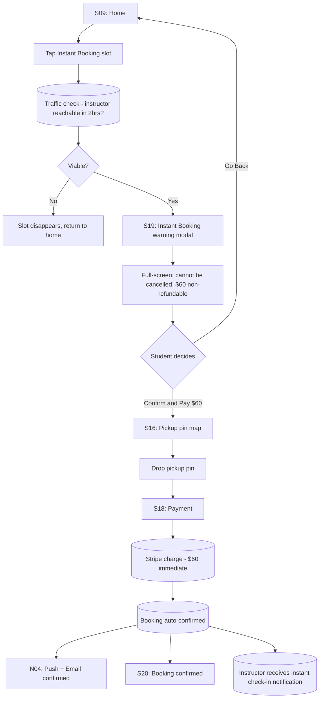
```mermaid
flowchart TD
  S09[S09: Home] --> TapInstant[Tap Instant Booking slot]
  TapInstant --> Traffic[(Traffic check - instructor reachable in 2hrs?)]
  Traffic --> Reachable{Viable?}
  Reachable -->|No| Suppress[Slot disappears, return to home]
  Reachable -->|Yes| S19[S19: Instant Booking warning modal]
  S19 --> Warning[Full-screen: cannot be cancelled, $60 non-refundable]
  Warning --> Decide{Student decides}
  Decide -->|Go Back| S09
  Decide -->|Confirm and Pay $60| S16[S16: Pickup pin map]
  S16 --> Drop[Drop pickup pin]
  Drop --> S18[S18: Payment]
  S18 --> Pay[(Stripe charge - $60 immediate)]
  Pay --> Confirm[(Booking auto-confirmed)]
  Confirm --> N04[N04: Push + Email confirmed]
  Confirm --> S20[S20: Booking confirmed]
  Confirm --> InstantCheckIn[(Instructor receives instant check-in notification)]
```

---

### 5.8 Pre-Lesson Reminder Cadence

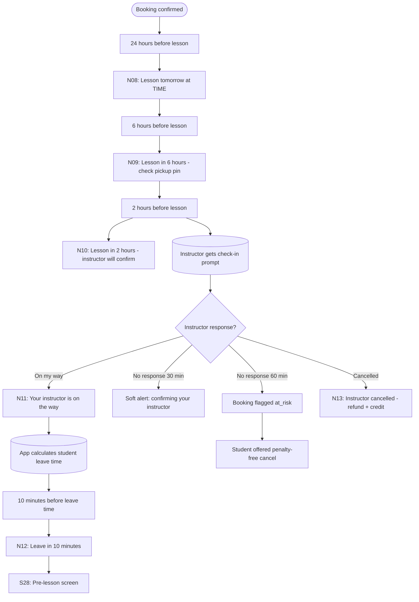
```mermaid
flowchart TD
  Confirmed([Booking confirmed]) --> Day1[24 hours before lesson]
  Day1 --> N08[N08: Lesson tomorrow at TIME]
  N08 --> H6[6 hours before lesson]
  H6 --> N09[N09: Lesson in 6 hours - check pickup pin]
  N09 --> H2[2 hours before lesson]
  H2 --> N10[N10: Lesson in 2 hours - instructor will confirm]
  H2 --> InstructorPrompted[(Instructor gets check-in prompt)]
  InstructorPrompted --> InstructorResp{Instructor response?}
  InstructorResp -->|On my way| N11[N11: Your instructor is on the way]
  InstructorResp -->|No response 30 min| SoftAlert[Soft alert: confirming your instructor]
  InstructorResp -->|No response 60 min| AtRisk[Booking flagged at_risk]
  InstructorResp -->|Cancelled| N13[N13: Instructor cancelled - refund + credit]
  N11 --> CalcLeave[(App calculates student leave time)]
  CalcLeave --> LeaveTime[10 minutes before leave time]
  LeaveTime --> N12[N12: Leave in 10 minutes]
  N12 --> S28[S28: Pre-lesson screen]
  AtRisk --> StudentOption[Student offered penalty-free cancel]
```

---

### 5.9 Lesson Day - Pickup and Lesson Execution

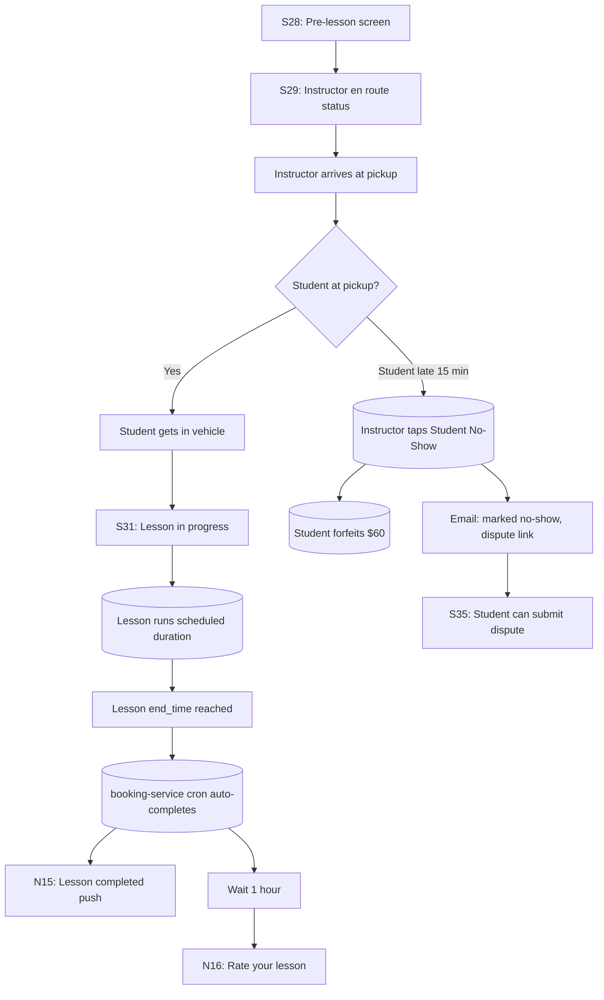
```mermaid
flowchart TD
  S28[S28: Pre-lesson screen] --> S29[S29: Instructor en route status]
  S29 --> Arrive[Instructor arrives at pickup]
  Arrive --> Match{Student at pickup?}
  Match -->|Yes| Greet[Student gets in vehicle]
  Match -->|Student late 15 min| NoShow[(Instructor taps Student No-Show)]
  NoShow --> Forfeit[(Student forfeits $60)]
  NoShow --> NoShowEmail[Email: marked no-show, dispute link]
  Greet --> S31[S31: Lesson in progress]
  S31 --> Time[(Lesson runs scheduled duration)]
  Time --> EndTime[Lesson end_time reached]
  EndTime --> AutoComplete[(booking-service cron auto-completes)]
  AutoComplete --> N15[N15: Lesson completed push]
  AutoComplete --> WaitRate[Wait 1 hour]
  WaitRate --> N16[N16: Rate your lesson]
  NoShowEmail --> S35[S35: Student can submit dispute]
```

---

### 5.10 Post-Lesson Rating

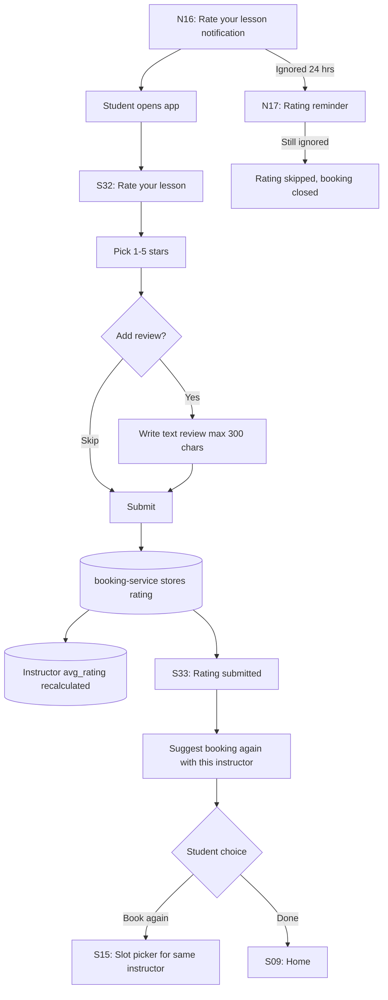
```mermaid
flowchart TD
  N16[N16: Rate your lesson notification] --> Open[Student opens app]
  Open --> S32[S32: Rate your lesson]
  S32 --> Stars[Pick 1-5 stars]
  Stars --> ReviewOpt{Add review?}
  ReviewOpt -->|Yes| WriteReview[Write text review max 300 chars]
  ReviewOpt -->|Skip| Submit[Submit]
  WriteReview --> Submit
  Submit --> Save[(booking-service stores rating)]
  Save --> UpdateAvg[(Instructor avg_rating recalculated)]
  Save --> S33[S33: Rating submitted]
  S33 --> Suggest[Suggest booking again with this instructor]
  Suggest --> Choice{Student choice}
  Choice -->|Book again| S15[S15: Slot picker for same instructor]
  Choice -->|Done| S09[S09: Home]
  N16 -->|Ignored 24 hrs| N17[N17: Rating reminder]
  N17 -->|Still ignored| Skip[Rating skipped, booking closed]
```

---

### 5.11 Cancellation - Within 1-Hour Grace Period

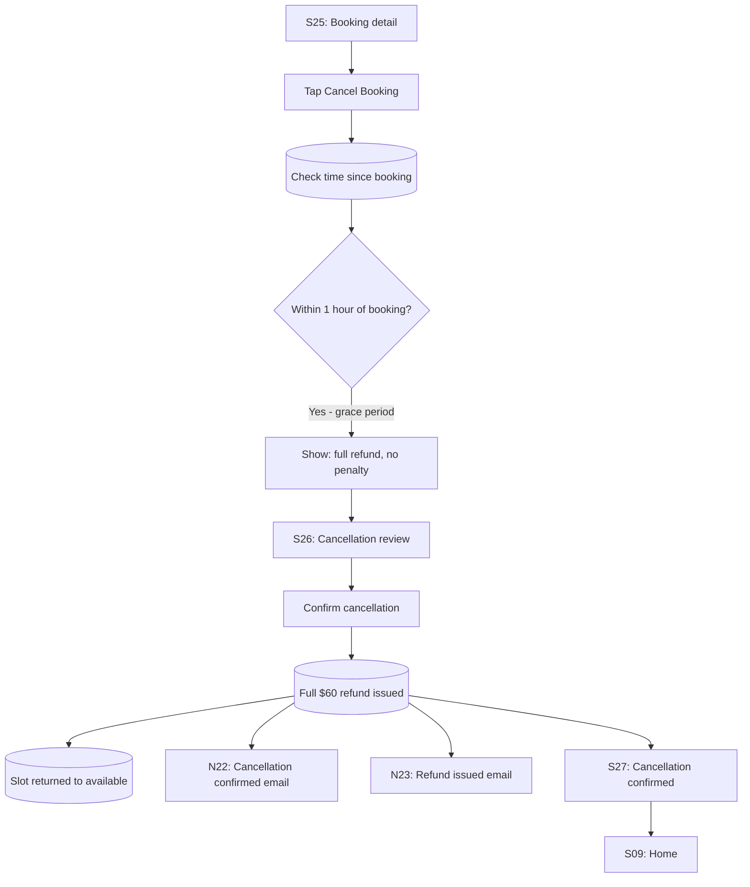
```mermaid
flowchart TD
  S25[S25: Booking detail] --> TapCancel[Tap Cancel Booking]
  TapCancel --> CheckTime[(Check time since booking)]
  CheckTime --> Window{Within 1 hour of booking?}
  Window -->|Yes - grace period| GraceMsg[Show: full refund, no penalty]
  GraceMsg --> S26[S26: Cancellation review]
  S26 --> Confirm[Confirm cancellation]
  Confirm --> Process[(Full $60 refund issued)]
  Process --> SlotFreed[(Slot returned to available)]
  Process --> N22[N22: Cancellation confirmed email]
  Process --> N23[N23: Refund issued email]
  Process --> S27[S27: Cancellation confirmed]
  S27 --> S09[S09: Home]
```

---

### 5.12 Cancellation - Standard Booking, Outside Grace Period

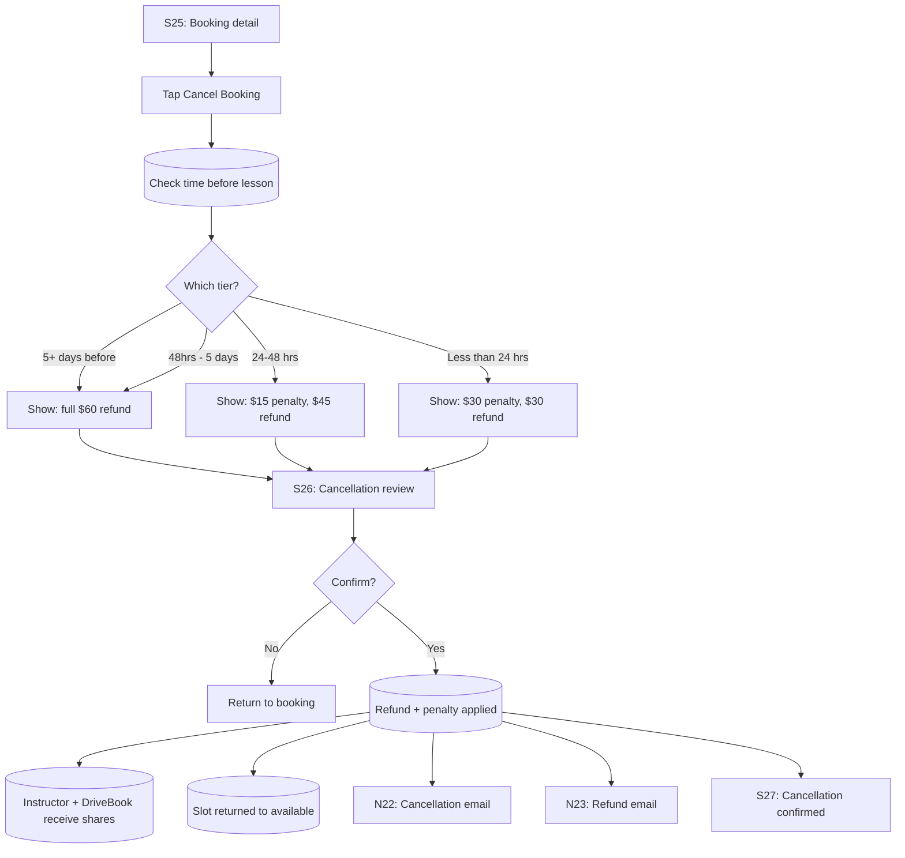
```mermaid
flowchart TD
  S25[S25: Booking detail] --> TapCancel[Tap Cancel Booking]
  TapCancel --> CheckTier[(Check time before lesson)]
  CheckTier --> Tier{Which tier?}
  Tier -->|5+ days before| FullRefund[Show: full $60 refund]
  Tier -->|48hrs - 5 days| FullRefund
  Tier -->|24-48 hrs| Tier25[Show: $15 penalty, $45 refund]
  Tier -->|Less than 24 hrs| Tier50[Show: $30 penalty, $30 refund]
  FullRefund --> S26
  Tier25 --> S26
  Tier50 --> S26
  S26[S26: Cancellation review] --> ConfirmCancel{Confirm?}
  ConfirmCancel -->|No| Back[Return to booking]
  ConfirmCancel -->|Yes| Process[(Refund + penalty applied)]
  Process --> Distribute[(Instructor + DriveBook receive shares)]
  Process --> SlotFreed[(Slot returned to available)]
  Process --> N22[N22: Cancellation email]
  Process --> N23[N23: Refund email]
  Process --> S27[S27: Cancellation confirmed]
```

---

### 5.13 Instructor Cancels on Student

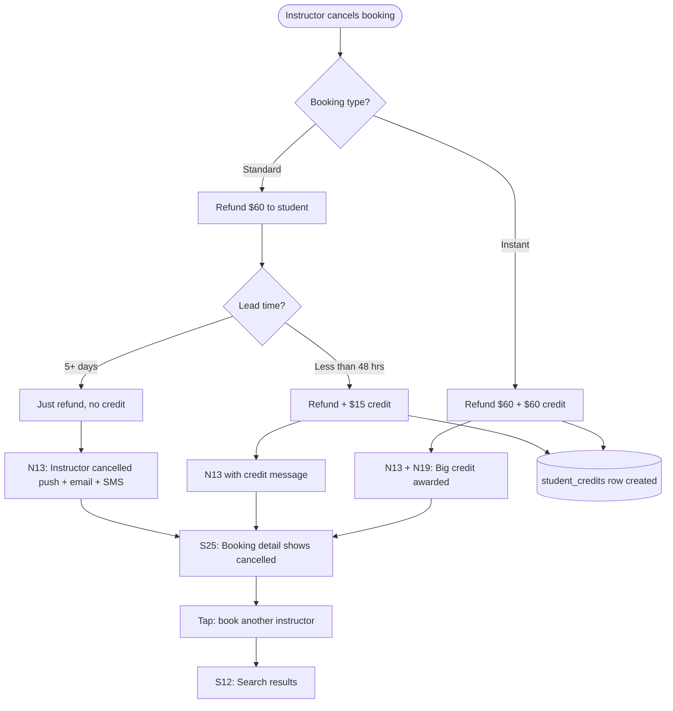
```mermaid
flowchart TD
  Trigger([Instructor cancels booking]) --> Type{Booking type?}
  Type -->|Standard| StandardFlow[Refund $60 to student]
  Type -->|Instant| InstantFlow[Refund $60 + $60 credit]
  StandardFlow --> LeadTime{Lead time?}
  LeadTime -->|5+ days| StandardOnly[Just refund, no credit]
  LeadTime -->|Less than 48 hrs| WithCredit[Refund + $15 credit]
  StandardOnly --> N13a[N13: Instructor cancelled push + email + SMS]
  WithCredit --> N13b[N13 with credit message]
  InstantFlow --> N13c[N13 + N19: Big credit awarded]
  N13a --> S25[S25: Booking detail shows cancelled]
  N13b --> S25
  N13c --> S25
  WithCredit --> CreditLedger[(student_credits row created)]
  InstantFlow --> CreditLedger
  S25 --> Rebook[Tap: book another instructor]
  Rebook --> S12[S12: Search results]
```

---

### 5.14 Using Student Credits at Checkout

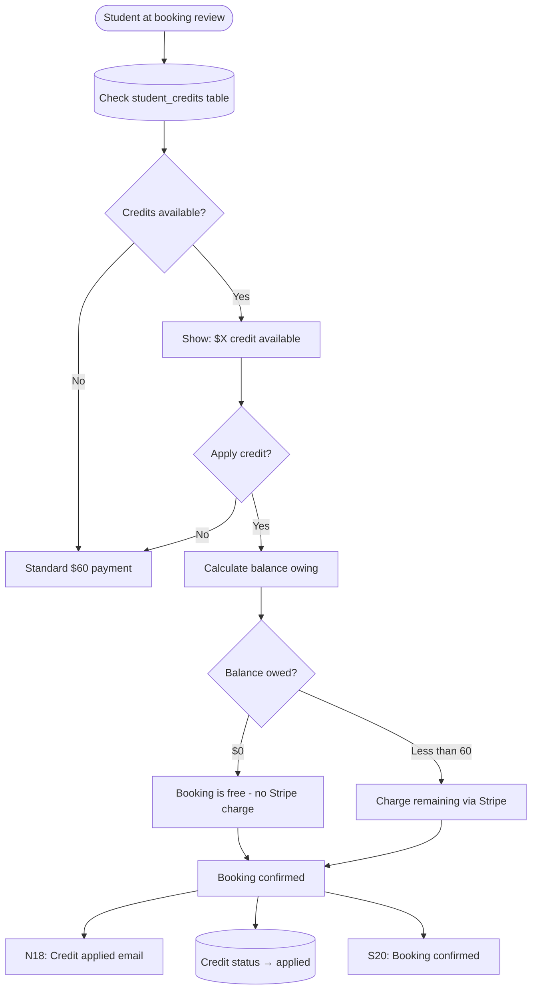
```mermaid
flowchart TD
  Checkout([Student at booking review]) --> Check[(Check student_credits table)]
  Check --> HasCredit{Credits available?}
  HasCredit -->|No| StandardPay[Standard $60 payment]
  HasCredit -->|Yes| ShowCredit[Show: $X credit available]
  ShowCredit --> Apply{Apply credit?}
  Apply -->|Yes| Calculate[Calculate balance owing]
  Apply -->|No| StandardPay
  Calculate --> Owed{Balance owed?}
  Owed -->|$0| FreeBooking[Booking is free - no Stripe charge]
  Owed -->|Less than 60| PartialPay[Charge remaining via Stripe]
  FreeBooking --> Confirmed[Booking confirmed]
  PartialPay --> Confirmed
  Confirmed --> N18[N18: Credit applied email]
  Confirmed --> Mark[(Credit status → applied)]
  Confirmed --> S20[S20: Booking confirmed]
```

---

### 5.15 Dispute Submission

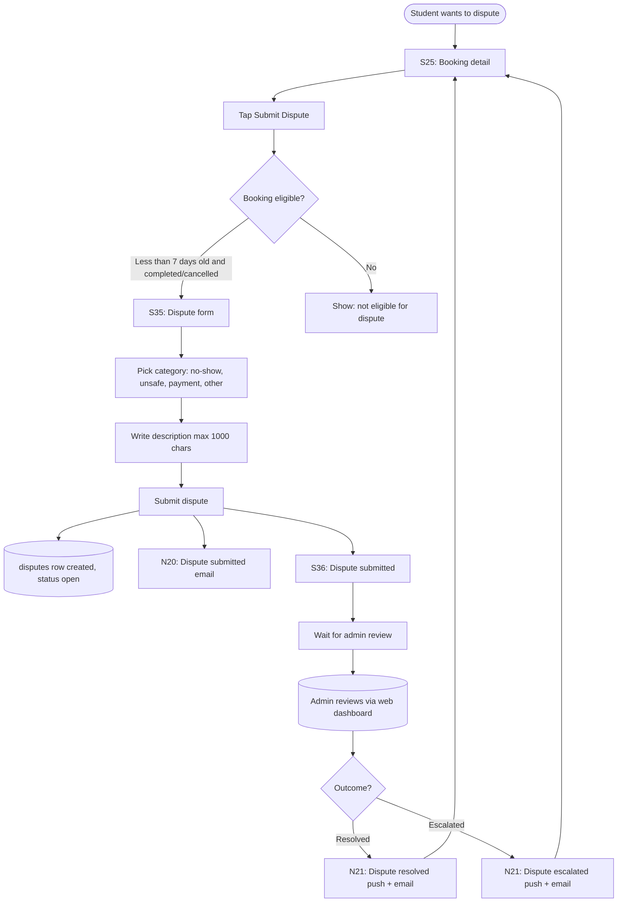
```mermaid
flowchart TD
  Trigger([Student wants to dispute]) --> S25[S25: Booking detail]
  S25 --> TapDispute[Tap Submit Dispute]
  TapDispute --> Eligible{Booking eligible?}
  Eligible -->|Less than 7 days old and completed/cancelled| S35[S35: Dispute form]
  Eligible -->|No| Reject[Show: not eligible for dispute]
  S35 --> Category[Pick category: no-show, unsafe, payment, other]
  Category --> Describe[Write description max 1000 chars]
  Describe --> Submit[Submit dispute]
  Submit --> Create[(disputes row created, status open)]
  Submit --> N20[N20: Dispute submitted email]
  Submit --> S36[S36: Dispute submitted]
  S36 --> Wait[Wait for admin review]
  Wait --> Admin[(Admin reviews via web dashboard)]
  Admin --> Resolution{Outcome?}
  Resolution -->|Resolved| N21a[N21: Dispute resolved push + email]
  Resolution -->|Escalated| N21b[N21: Dispute escalated push + email]
  N21a --> S25
  N21b --> S25
```

---

### 5.16 Booking History + Re-Booking

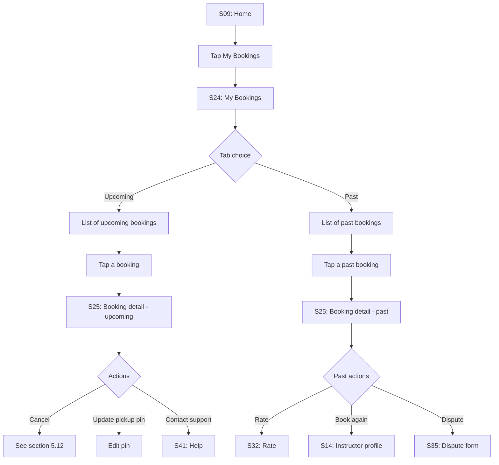
```mermaid
flowchart TD
  S09[S09: Home] --> Tap[Tap My Bookings]
  Tap --> S24[S24: My Bookings]
  S24 --> Tabs{Tab choice}
  Tabs -->|Upcoming| Upcoming[List of upcoming bookings]
  Tabs -->|Past| Past[List of past bookings]
  Upcoming --> TapBooking[Tap a booking]
  Past --> TapPast[Tap a past booking]
  TapBooking --> S25[S25: Booking detail - upcoming]
  TapPast --> S25Past[S25: Booking detail - past]
  S25 --> Options{Actions}
  Options -->|Cancel| CancelFlow[See section 5.12]
  Options -->|Update pickup pin| EditPin[Edit pin]
  Options -->|Contact support| S41[S41: Help]
  S25Past --> PastOptions{Past actions}
  PastOptions -->|Rate| S32[S32: Rate]
  PastOptions -->|Book again| S14[S14: Instructor profile]
  PastOptions -->|Dispute| S35[S35: Dispute form]
```

---

### 5.17 Account Settings

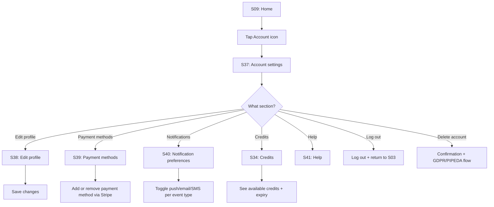
```mermaid
flowchart TD
  S09[S09: Home] --> Tap[Tap Account icon]
  Tap --> S37[S37: Account settings]
  S37 --> Options{What section?}
  Options -->|Edit profile| S38[S38: Edit profile]
  Options -->|Payment methods| S39[S39: Payment methods]
  Options -->|Notifications| S40[S40: Notification preferences]
  Options -->|Credits| S34[S34: Credits]
  Options -->|Help| S41[S41: Help]
  Options -->|Log out| Logout[Log out + return to S03]
  Options -->|Delete account| DeleteFlow[Confirmation + GDPR/PIPEDA flow]
  S38 --> Save[Save changes]
  S39 --> AddCard[Add or remove payment method via Stripe]
  S40 --> Toggle[Toggle push/email/SMS per event type]
  S34 --> ListCredits[See available credits + expiry]
```

---

### 5.18 Empty States and Error States

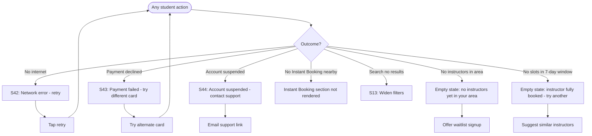
```mermaid
flowchart TD
  Action([Any student action]) --> Result{Outcome?}
  Result -->|No internet| S42[S42: Network error - retry]
  Result -->|Payment declined| S43[S43: Payment failed - try different card]
  Result -->|Account suspended| S44[S44: Account suspended - contact support]
  Result -->|No instructors in area| EmptyArea[Empty state: no instructors yet in your area]
  Result -->|No slots in 7-day window| EmptySlots[Empty state: instructor fully booked - try another]
  Result -->|No Instant Booking nearby| HideInstant[Instant Booking section not rendered]
  Result -->|Search no results| S13[S13: Widen filters]
  S42 --> Retry[Tap retry]
  S43 --> Alt[Try alternate card]
  S44 --> Contact[Email support link]
  EmptyArea --> Waitlist[Offer waitlist signup]
  EmptySlots --> Suggest[Suggest similar instructors]
  Retry --> Action
  Alt --> Action
```

---

## 6. Cross-Persona Scenario Coverage

How each flow serves the three student personas:

| Flow | Alex (G2 repeater) | Priya (newcomer) | Marcus (G prep) |
|---|---|---|---|
| Signup | Standard | Hindi UI preference (Phase 2) | Standard |
| Search filter | Filter: Mandarin | Filter: Hindi | Filter: English |
| Instructor profile | Look for G2 specialty | Look for nervous-driver friendly | Look for high rating |
| Pickup pin | Home address | Subway station | Office |
| Cancellation | Late notice from shift work | Plans well in advance | Last-minute meetings |
| Re-booking | Same instructor for consistency | Different instructors to compare | Same instructor for rapport |

---

## 7. Open Items for Design Phase

These are deferred to Figma/UX design, not blocking the journey definition:

- Welcome carousel content (3 slides — what messages?)
- Empty state illustrations and tone
- Instant Booking section visual treatment (horizontal scroll, banner, hero card?)
- "Confirms Instantly" badge design
- Pickup pin map interaction (search box, current location, recent pins)
- Rating screen tone (playful, neutral, professional?)
- Credit display in checkout (automatic apply vs. checkbox opt-in)
- Dispute form structure (free text, multiple choice, photo upload?)
- Notification preference granularity (per event type vs. per channel)

---

## 8. Summary

The student journey covers **44 distinct screens** and **23 notification events** across **18 feature flows**. Every flow is deterministic — given a student action and the system state, the next screen is fully defined.

This document, paired with `DriveBook_Instructor_Journey.md`, defines the complete consumer-facing surface of DriveBook. The Master document (`DriveBook_Master_User_Journey.md`) shows how the two journeys interconnect at handoff moments.

---

*DriveBook Student Journey v1.0*
